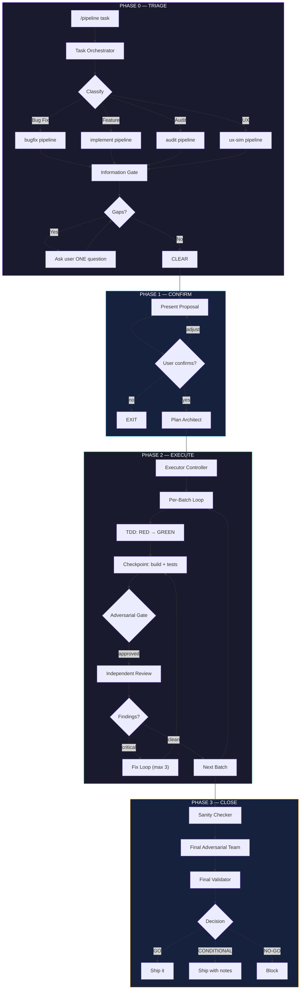
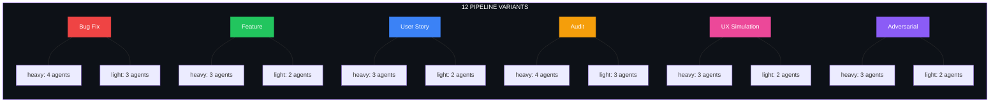
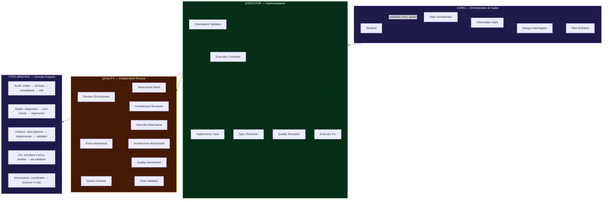
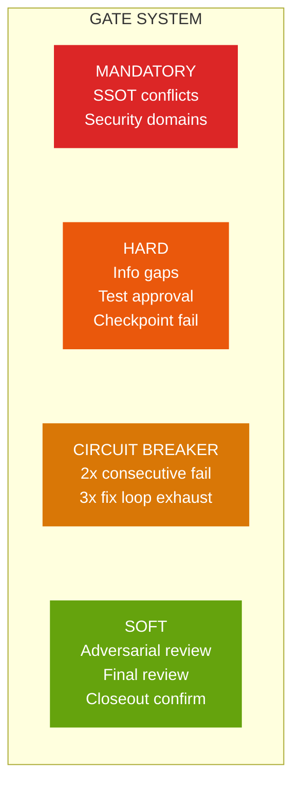

<div align="center">
  
</div>

<h1 align="center">Pipeline Orchestrator</h1>

<p align="center">
  <strong>The AI agent pipeline that catches what humans miss.</strong><br/>
  <em>37 specialized agents. 12 pipeline types. 1 command.</em>
</p>

<p align="center">
  
  
  
  
</p>

<p align="center">
  <a href="#quickstart">Quickstart</a> &bull;
  <a href="#how-it-works">How It Works</a> &bull;
  <a href="#pipeline-types">Pipeline Types</a> &bull;
  <a href="#agent-teams">Agent Teams</a> &bull;
  <a href="#commands">Commands</a> &bull;
  <a href="#architecture">Architecture</a>
</p>

---

## The Problem

You ship code. Tests pass. Linter is green. PR looks clean.

**Then production breaks.**

A silent auth bypass. A race condition under load. An SSOT conflict between two services that nobody noticed. The kind of bugs that code review *should* catch — but doesn't, because reviewers share the same context as the author.

**Pipeline Orchestrator solves this with adversarial independence.** Every batch of work is reviewed by agents that have *zero knowledge* of how the code was written. They see only the result. They attack it from security, architecture, and quality angles — simultaneously, in parallel, with no shared context.

> *"The adversarial review on Batch 3 caught a privilege escalation path that three human reviewers missed."*

---

## Quickstart

```bash
# Add the FX Studio AI marketplace
claude plugin add-marketplace https://github.com/fernandoxavier02/FX-Studio-AI

# Install the plugin
claude plugin add pipeline-orchestrator

# Run your first pipeline
/pipeline fix the login timeout bug
```

That's it. The orchestrator classifies your task, selects the right pipeline, and executes — with TDD, adversarial review, and Go/No-Go validation.

---

## How It Works

Every task flows through 4 phases. The depth of each phase scales automatically with complexity.



### Adaptive Complexity

The pipeline adjusts its rigor automatically. No configuration needed.

| Complexity | Files | Batch Size | Sentinel | Design Review | Adversarial |
|:---:|:---:|:---:|:---:|:---:|:---:|
| **SIMPLES** | 1-2 | All at once | 1 checkpoint | Skipped | 3 checklists |
| **MEDIA** | 3-5 | 2-3 tasks | 2 checkpoints | Optional | 5 checklists |
| **COMPLEXA** | 6+ | 1 task | 5 checkpoints | Automatic | 7 checklists |

---

## Pipeline Types

Six specialized pipeline families — each with **light** and **heavy** variants — cover every development scenario.



| Pipeline | When | What Happens |
|----------|------|-------------|
| **Bug Fix** | Production bugs, regressions | Diagnostic → Root Cause Analysis → TDD Fix → Regression Suite |
| **Feature** | New capabilities, enhancements | Vertical Slice Planning → Implementation → Integration Validation |
| **User Story** | User-facing stories | Same team as Feature, scoped by acceptance criteria |
| **Audit** | Code health, compliance | Intake → Domain Analysis → Compliance Check → Risk Matrix |
| **UX Simulation** | User experience analysis | Persona Simulation ‖ Accessibility Audit → QA Validation |
| **Adversarial** | Security & architecture review | Security Scanner ‖ Architecture Critic → Consolidated Report |

---

## Agent Teams

### The 37-Agent Architecture

Pipeline Orchestrator deploys agents in three layers — each with a distinct role and zero context leakage between layers.



### Type-Specific Teams by Pipeline

| Pipeline | Agents | Execution Flow |
|----------|--------|---------------|
| **Bug Fix Heavy** | 4 agents | `diagnostic` → `root-cause-analyzer` → `implementer` → `regression-tester` |
| **Bug Fix Light** | 3 agents | `diagnostic` → `implementer` → `regression-tester` |
| **Feature Heavy** | 3 agents | `vertical-slice-planner` → `implementer` → `integration-validator` |
| **Feature Light** | 2 agents | `vertical-slice-planner` → `implementer` |
| **Audit Heavy** | 4 agents | `intake` → `domain-analyzer` → `compliance-checker` → `risk-matrix` |
| **Audit Light** | 3 agents | `intake` → `compliance-checker` → `risk-matrix` |
| **UX Heavy** | 3 agents | `simulator` ‖ `a11y-auditor` → `qa-validator` |
| **UX Light** | 2 agents | `simulator` → `qa-validator` |
| **Adversarial Heavy** | 3 agents | `coordinator` → `security-scanner` ‖ `architecture-critic` |
| **Adversarial Light** | 2 agents | `coordinator` → `security-scanner` |

> **‖** = parallel execution with zero shared context

---

## Commands

| Command | Description |
|---------|-------------|
| `/pipeline [task]` | Full pipeline — triage, plan, execute, close |
| `/pipeline --hotfix [task]` | Emergency mode — reduced ceremony, production focus |
| `/pipeline --plan [task]` | Force implementation planning for any complexity |
| `/pipeline --grill [task]` | Force design interrogation for any complexity |
| `/pipeline review-only` | Adversarial review of current changes (no execution) |
| `/pipeline diagnostic [task]` | Classification + proposal only (dry run) |
| `/pipeline continue` | Resume an interrupted pipeline session |

### Complexity Overrides

| Flag | Effect |
|------|--------|
| `--simples` | Force SIMPLES — all tasks in one batch, light ceremony |
| `--media` | Force MEDIA — 2-3 tasks per batch, moderate ceremony |
| `--complexa` | Force COMPLEXA — 1 task per batch, full ceremony |

---

## Architecture

### Defense in Depth

Every layer of the pipeline has independent safety mechanisms. No single point of failure.



| Gate Type | Can Skip? | User Override? | Example |
|-----------|:---------:|:--------------:|---------|
| **MANDATORY** | Never | No | SSOT conflict, auth/crypto domain review |
| **HARD** | No | Resolution only | Missing info, test approval, build failure |
| **CIRCUIT BREAKER** | No | Reset only | 2 consecutive failures, 3 fix attempts |
| **SOFT** | Yes (logged) | Yes | Adversarial review, final review |

### Sentinel — Pipeline Guardian

The Sentinel agent validates every phase transition and every agent spawn. It operates independently of the execution flow and cannot be bypassed.

- **5 mandatory checkpoints** across the pipeline lifecycle
- **PreToolUse hook** validates every `Agent` spawn against expected sequence
- **Coherence validation** at every phase boundary
- **Auto-correction** for minor deviations, hard block for anomalies

### Confidence Scoring

The pipeline accumulates a confidence score across all phases — an objective quality signal that feeds into the final Go/No-Go decision.

```
Confidence = avg(
  classification_clarity,    # Phase 0 — was the task type clear?
  info_completeness,         # Phase 0 — were all gaps resolved?
  design_alignment,          # Phase 0 — design decisions settled?
  plan_coverage,             # Phase 1.5 — does the plan cover everything?
  tdd_coverage,              # Phase 2 — are tests adequate?
  implementation_quality     # Phase 2 — code review quality?
) + gate_penalty             # Accumulated from skipped SOFT gates

GO:          >= 0.80
CONDITIONAL: >= 0.60
NO-GO:       <  0.60
```

---

## Why Pipeline Orchestrator?

<table>
<tr>
<td width="50%">

### Without Pipeline Orchestrator

- Manual task breakdown
- Inconsistent review depth
- Shared context bias in reviews
- No structured adversarial testing
- "Ship and pray" deployment

</td>
<td width="50%">

### With Pipeline Orchestrator

- Auto-classification & adaptive batching
- Proportional review depth by complexity
- **Zero-context adversarial reviews**
- Security + Architecture + Quality gates
- Confidence-scored Go/No-Go decisions

</td>
</tr>
</table>

### Key Differentiators

**Context Isolation** — Review agents never see implementation reasoning. They attack the code blind, the way a real attacker would.

**Proportional Rigor** — A one-line typo fix doesn't get the same ceremony as a payment system rewrite. The pipeline scales automatically.

**Fail-Safe Gates** — MANDATORY gates cannot be bypassed, even by `--hotfix`. CIRCUIT BREAKERs stop the pipeline before damage compounds. Every skip is logged and penalizes the confidence score.

**TDD by Default** — Tests are written BEFORE implementation (RED phase), approved by the user, and validated after every batch. Not optional for code-changing pipelines.

---

## Project Structure

```
pipeline-orchestrator/
├── agents/
│   ├── core/                    # 8 orchestration agents
│   │   ├── task-orchestrator    # Entry point — classifies tasks
│   │   ├── information-gate     # Detects missing context
│   │   ├── sentinel             # Pipeline guardian
│   │   ├── checkpoint-validator # Build + test verification
│   │   ├── sanity-checker       # Final sanity verification
│   │   ├── final-validator      # Go/No-Go decision (Pa de Cal)
│   │   └── finishing-branch     # Closeout options
│   ├── executor/                # 6 execution agents
│   │   ├── executor-controller  # Batch orchestration
│   │   ├── executor-implementer # Per-task implementation
│   │   ├── executor-fix         # Targeted fixes for findings
│   │   ├── executor-spec-reviewer
│   │   ├── executor-quality-reviewer
│   │   └── type-specific/       # 16 domain expert agents
│   │       ├── audit-*          # 4 audit specialists
│   │       ├── bugfix-*         # 3 bugfix specialists
│   │       ├── feature-*        # 3 feature specialists
│   │       ├── ux-*             # 3 UX specialists
│   │       └── adversarial-*    # 3 adversarial specialists
│   └── quality/                 # 7 review agents
│       ├── review-orchestrator  # Per-batch review coordination
│       ├── adversarial-batch    # Security checklist review
│       ├── architecture-reviewer
│       ├── design-interrogator
│       ├── plan-architect
│       ├── quality-gate-router  # TDD scenario generation
│       └── pre-tester           # RED phase test creation
├── commands/
│   └── pipeline.md              # The /pipeline command
├── references/
│   ├── pipelines/               # 12 pipeline variant definitions
│   ├── checklists/              # 7 security checklists
│   ├── team-registry.md         # Agent-to-team SSOT
│   ├── complexity-matrix.md     # Classification rules
│   └── glossary.md              # Term definitions
├── hooks/
│   └── hooks.json               # Sentinel PreToolUse hook
└── skills/
    └── pipeline/SKILL.md        # Auto-trigger skill
```

---

## Requirements

- [Claude Code](https://claude.com/claude-code) CLI or Desktop App
- No external dependencies — pure markdown agents

---

## License

MIT License — see [LICENSE](LICENSE) for details.

---

<div align="center">
  <br/>
  <strong>Built by <a href="https://github.com/fernandoxavier02">Fernando Xavier</a></strong>
  <br/>
  <a href="https://fxstudioai.com">FX Studio AI</a> — Business Automation with AI
  <br/><br/>
  <sub>37 agents working together so you don't have to.</sub>
</div>
