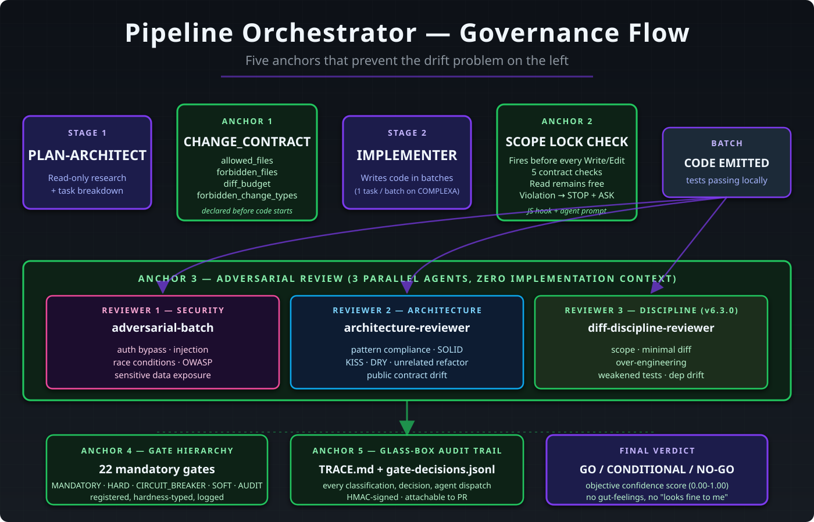
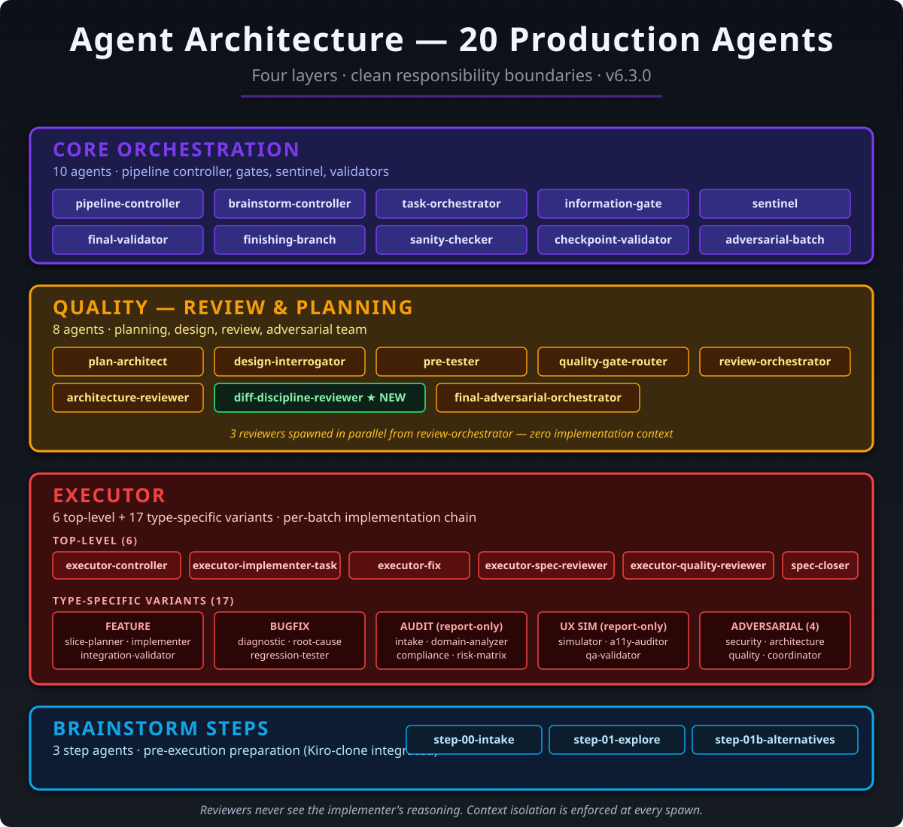

<div align="center">
  <a href="https://fxstudioai.com">
    
  </a>
</div>

<div align="center">
  
</div>

<h1 align="center">Pipeline Orchestrator</h1>

<p align="center"><strong>The governance layer between your spec and your production code — now with first-class observability.</strong></p>

<p align="center">
  
  
  
  
  
  
  
  
</p>

<p align="center">
  <a href="#the-problem">The Problem</a> &bull;
  <a href="#how-we-fix-it">How We Fix It</a> &bull;
  <a href="#paperclip-integration">Paperclip ✨</a> &bull;
  <a href="#whats-new-in-v80">v8.0</a> &bull;
  <a href="#whats-new-in-v79">v7.9</a> &bull;
  <a href="#whats-new-in-v740">v7.4.0</a> &bull;
  <a href="#whats-new-in-v720">v7.2.0</a> &bull;
  <a href="#workflow-contracts--atdd--bdd--ddd-v610">ATDD · BDD · DDD</a> &bull;
  <a href="#install">Install</a> &bull;
  <a href="#pipeline-types">Pipelines</a> &bull;
  <a href="#agent-architecture">Architecture</a> &bull;
  <a href="#gate-system">Gates</a> &bull;
  <a href="#audit-reports">Audit</a>
</p>

---

> **Heads-up:** This repository is both the Pipeline Orchestrator plugin **and** the **FX-Studio-AI** marketplace hosting multiple plugins. Install the marketplace once to access them all. See <a href="#fx-studio-ai-suite">the suite section</a>.

---

## The Problem

There is no shortage of tools that help you decide *what* to build — Jira, Linear, Notion, ADRs, spec templates, Kiro. They handle the *plan*. But when AI takes the plan and turns it into production code, the industry relies on human discipline. **Discipline degrades under pressure, time constraints, and long-running sessions.**

<div align="center">
  
</div>

Long AI coding sessions follow a predictable degradation curve:

- **Batches 1-3 (clean):** the AI follows the spec. Tests pass. Diff is tight.
- **Batches 4-7 (scope creep):** the AI starts "improving" adjacent code. *"Let me also refactor this related function..."*. Unrelated edits accumulate.
- **Batches 8-11 (drift):** new dependencies appear unannounced. A test failure turns into a weaker assertion instead of a fixed bug. The implementation no longer matches the original requirements.
- **Batches 12+ (contract broken):** the code passes CI but no longer solves the problem you asked it to solve. You discover this hours later, often in production.

Traditional CI/CD catches syntax errors and regressions. It does not catch architectural drift, weakened tests, scope creep in batch 7, or the fact that your AI added an unauthorized dependency three batches ago.

**Pipeline Orchestrator is an execution governance layer that sits between your plan and your production code.** It does not replace your planning tools. It closes the gap between *"we have a spec"* and *"we shipped it safely"*.

---

## How We Fix It

Five anchors keep long sessions on contract. Each one is independent — failures in one do not propagate. Together they form a defense in depth.

<div align="center">
  
</div>

### 1. CHANGE_CONTRACT — Scope is declared *before* the code is written

Every plan emits an inline `CHANGE_CONTRACT` block listing exactly which files may be modified, which may be created, which are forbidden, and what categories of change require explicit approval (new dependency, public API change, schema migration, sensitive config edit, test weakening). The contract has a `diff_budget` ceiling — exceeding it by more than 20% triggers an escalation. **No more "I just refactored a bit while I was there."**

### 2. SCOPE LOCK CHECK — Runtime enforcement before every Write/Edit

The implementer agent runs a 5-check gate before emitting any code-changing tool call. Targets outside `allowed_files`? Stops. Forbidden change type detected? Stops. Diff budget exhausted? Stops. On violation, the agent returns a structured `QUESTIONS` status with `question.context: scope_lock_violation` and asks you whether to expand the contract or redirect. **Backed by a JS PreToolUse hook (`scope-lock-hook.cjs`) so the enforcement holds even when the LLM tries to be clever.**

### 3. Adversarial Independence — Three reviewers attack each batch with zero implementation context

Every batch is reviewed by three parallel agents that never saw what the implementer intended. They see only the result. They evaluate from three angles simultaneously:

- **adversarial-batch** — security (auth bypass, injection, race conditions, sensitive data exposure)
- **architecture-reviewer** — patterns (SOLID, KISS, DRY, unrelated refactor, public contract drift)
- **diff-discipline-reviewer** (new in v6.3.0) — scope (minimal diff, over-engineering, weakened tests, dependency drift)

The three are spawned in a *single* parent message with three Agent tool calls — guaranteed parallel, guaranteed independent. No sequential contamination, no shared context. Each loads only the checklists it needs. **This is what kills confirmation bias.**

### 4. Gate Hierarchy — 23 mandatory checkpoints with formal hardness types

Gates are not ceremonial checkboxes. Each has a defined hardness that determines exactly how it behaves:

| Hardness | Behavior |
|---|---|
| **MANDATORY** | Never bypassed. Not even by `--hotfix` or `--force`. Applies regardless of mode. Reserved for structural integrity (SSOT) and domain-mandated security reviews. |
| **HARD** | Blocks until resolved. Pipeline stops at the gate; user must answer or the issue must be fixed. No silent skips. |
| **CIRCUIT_BREAKER** | After N consecutive failures (typically 2-3 attempts), pipeline halts and requires explicit reset. Prevents infinite loops. |
| **SOFT** | Recommended but skippable with explicit acknowledgment. Every skip is logged with a confidence penalty. |
| **AUDIT** (v6.2+) | Informational telemetry. Never blocks, never asks. Used for observability events that need first-class audit-trail entries. |

The full 35-row registry (23 mandatory + 12 contextual/soft) lives in [`references/gates.md`](references/gates.md). The 23-row Mandatory Gates by Complexity table is invariant — pinned by regression test `F1_gates_mandatory_section.cjs`, which fails the build if anyone changes the count.

### 5. Glass-Box Audit Trail — Every decision is recorded *and now streamable*

Every pipeline run emits `TRACE.md` + `gate-decisions.jsonl` under `.pipeline-orchestrator/runs/<run-id>/`. Classification, design decisions, plan approval, every gate trigger, every fix loop, every adversarial finding. **Attachable to your PR. Validatable with a standalone Node script. HMAC-signed sentinel state to prevent tampering.** Auditable, reproducible, accountable.

**New in v7.4.0:** every subagent dispatch also streams to <a href="https://langfuse.com">Langfuse Cloud</a> as a structured span (opt-in via two env vars). On-disk JSONL for compliance, Langfuse dashboard for trends — same source of truth, two surfaces. **See <a href="#whats-new-in-v79">what's new</a> below.**

```
GO:          confidence >= 0.80
CONDITIONAL: confidence >= 0.60
NO-GO:       confidence <  0.60
```

No gut feelings. No *"it looks fine to me."* A number, with the gate decisions that produced it.

---

## Paperclip integration

The same governance layer now runs on top of [Paperclip](https://paperclip.ing) — an open-source platform where autonomous agents pick up issues and execute them without a human babysitting each step. Three additive deliveries make this work, and none of them touches the standalone Claude Code path. Everything lives under `references/paperclip/`, fully documented in [`docs/PAPERCLIP-INTEGRATION.md`](docs/PAPERCLIP-INTEGRATION.md).

### Integration layer (v7.6.0) — run the plugin *inside* Paperclip

The `claude_local` adapter lets a Paperclip agent run the exact same workflow contracts the plugin enforces in Claude Code, with effective parity. The layer ships an inviolable axioms doc, six prompt-native workflow specs (Bug Fix / Feature / Audit / UX / Spec / Adversarial), an operational knowledge base, a catalog mapping every plugin agent to a Paperclip role, and **11 custom skills** in Paperclip's native format (a canonical `engineering-principles` skill plus ten `pipeline-orchestrator-*` wrappers). End-to-end pilot verdict: `PASS_WITH_NOTES`.

### Company provisioner (v7.8.0) — stand up the whole roster in one shot

`references/paperclip/scripts/provision-pipeline-company.cjs` stands up a Paperclip company with the full 47-cargo pipeline-orchestrator roster and attaches the right custom skills per role. It is ID-agnostic — it finds (or creates) the company by name, captures agent IDs at runtime to wire the org chart, and computes every path relative to itself, so it runs against any Paperclip instance with no hardcoded UUIDs. Agents are created with heartbeat OFF — inert until an issue is assigned, so provisioning never kicks off autonomous work by accident. Wired into the [`/pipeline-orchestrator:setup-paperclip`](commands/setup-paperclip.md) command.

### Flow-mirror (v7.9.0) — dispatch a whole pipeline as an issue tree

The flow-mirror reproduces all **14 pipeline flows** as a dependency-linked **tree of Paperclip issues**: each node blocks the next via `blockedByIssueIds`, so once the root is created the remote agents grow the tree in cascade with no manual handoff between steps. It ships **8 slash commands** — `/pipeline-orchestrator:paperclip-bugfix`, `-feature`, `-user-story`, `-audit`, `-ux`, `-spec`, `-hotfix`, and `-review` — each of which classifies the task locally, builds the tree in **dry-run** first, shows it to you, and only creates anything in Paperclip **after explicit confirmation**. The same dispatch is also reachable from the main pipeline via the `--on=paperclip` flag. The dry-run-then-confirm guard means no card is ever created on the server without you saying yes.

---

## What's New in v8.0

> **⚠️ Breaking change (v8.0.0 — MAJOR).** `/pipeline-orchestrator:spec` **changed meaning**. It no longer pre-classifies and implements an existing spec — it now **authors a brand-new specification from scratch** and seals it as a contract, then stops *before* any implementation.

**Spec-authoring takeover (v8.0.0).** `/pipeline-orchestrator:spec` now runs the full authoring lifecycle: brainstorm clarification → **proactive ideation** (it proposes improvements/features you didn't ask for, across product/architecture/code/UX/risk) → a forced, proportional **design-interrogation** → the Kiro lifecycle (init → requirements → design → tasks → research) → an **adversarial review of the spec documents** → a sealed, unbreakable **contract**. It interrogates every product-shaping gap instead of inventing answers, and halts at the sealed spec.

- **Migration.** If you relied on the old behavior (classify + implement an existing spec), use the preserved legacy entry points: `/pipeline-orchestrator:spec-light`, `/pipeline-orchestrator:spec-heavy`, `/pipeline-orchestrator:spec-audit-only`, or `/pipeline-orchestrator:pipeline --type=Spec`.
- New surfaces: `spec-controller`, the global brainstorm `step-01c-ideation`, `spec-adversarial-critic`, the `/spec-review` command, and the `--amend` re-seal flow. The **Gate Registry grows 35 → 43** (8 new AUDIT/SOFT telemetry events); the *Mandatory Gates by Complexity* table is **unchanged** (Iron Law).

**Paperclip parity + handoff fix (v8.0.1).** The Paperclip flow-mirror layer was updated to reflect the spec-authoring workflow (roster 47 → 50 cargos) and hardened against the handoff stalls where a cargo finished its work but never created the next step — *Montagem Progressiva* discipline plus structural root-cause guards. Additive; zero plugin-runtime change.

**Release hygiene (v8.0.2).** The npm tarball now matches the git tag exactly (a leaked runtime session lock was removed and the previously-npm-only `/help` command is tracked; `.npmignore` hardened for `**/.pipeline/` + `*.lock`, guarded by a new packaging test). The 13 Paperclip flow-mirror tests are now wired into the release gate, and the stale description/README prose was refreshed.

---

## What's New in v7.9

**Paperclip, end to end.** The headline of the 7.9 line is the [Paperclip integration](#paperclip-integration) above. The flow-mirror (v7.9.0) turns any of the 14 pipeline flows into a dependency-linked tree of Paperclip issues via **8 new slash commands**, each gated by a dry-run-then-confirm guard so nothing is created on the server without your yes. It builds on the company provisioner (v7.8.0) and the integration layer (v7.6.0).

**Telemetry that tells the truth (v7.9.1).** The per-session run-log aggregator had four defects that made summaries come out null or wrong — classification read from the wrong field, date-only timestamps inflating duration to hours, hardcoded gate/fidelity counts, and `final_decision` collapsing to `UNKNOWN`. All four fixed: `buildRunLogEntry` now derives the gate count from the mandatory-gates table and the fidelity score from the run's own report. New regression test, full suite green.

**Documentation refresh (v7.9.2).** This release brings every user-facing and reference doc up to date — README and diagrams (including a license fix), the full Paperclip layer documented in prose, the audit-trail run-log section rewritten to the v7.9.1 model, gate decision vocabulary aligned to the 8 canonical values, and count drift corrected (`35-gate registry`, `23-row mandatory table`, `61 tests`).

---

## What's New in v7.4.0

<div align="center">
  <a href="https://langfuse.com" target="_blank">
    
  </a>
  <p><sub><strong>Now natively integrated with <a href="https://langfuse.com">Langfuse Cloud</a></strong> — the open-source observability platform for LLM applications.</sub></p>
</div>

> **The governance layer just became observable.** Every subagent dispatch, every gate decision, every fix loop now streams to **Langfuse Cloud** as a structured trace — opt-in, zero-config beyond two env vars, and shippable to your existing observability stack. Plus first-class **Cursor IDE parity** and a new `skill-governance.md` SSOT codifying community patterns we learned from `langfuse/skills`.

<div align="center">

| | Before v7.4.0 | After v7.4.0 |
|---|---|---|
| **Per-subagent visibility** | Only on disk (`gate-decisions.jsonl` + `TRACE.md`) | Streamed to Langfuse Cloud in real time |
| **Cross-run analytics** | `jq` over JSONL files | Native dashboards, filters, sampling |
| **IDE parity** | Claude Code only | Claude Code **+** Cursor (lockstep manifests) |
| **Skill governance** | Implicit conventions | First-class SSOT (`references/skill-governance.md`) |

</div>

### 🔭 Langfuse Cloud observability — opt-in, two env vars away

Pipeline Orchestrator now ships a `PreToolUse:Agent` + `PostToolUse:Agent` hook (`.claude/hooks/langfuse-hook.cjs`) that opens a **fire-and-forget span per subagent dispatch** — captures the agent name, sanitized prompt, return, current pipeline phase, plugin version, and pipeline doc path. Atomic span-carrier files at `/tmp/langfuse-span-<PPID>.json` keep `Pre` and `Post` correlated even across process restarts. **Sampling is configurable** via `LANGFUSE_SAMPLE_RATE` (1.0 = trace everything, 0.1 = sample 1 in 10).

**Privacy by design.** The hook sanitizes prompts before send (strips absolute paths, redacts secrets) via `lib/langfuse-sanitizer.cjs`. The disabled fast-path (no credentials present) exits in under **100ms** — the SDK is never even `require()`'d at top level, only inside the credential-gated `getClient()`. **Offline-first guarantee preserved.**

```bash
# Three env vars and you're tracing.
export LANGFUSE_ENABLED=true
export LANGFUSE_PUBLIC_KEY=pk-lf-...
export LANGFUSE_SECRET_KEY=sk-lf-...
export LANGFUSE_HOST=https://us.cloud.langfuse.com   # or self-hosted
# optional:
export LANGFUSE_SAMPLE_RATE=1.0                       # 0.0 disables; 1.0 traces all
```

Run any pipeline. Dashboard fills in. **No code changes, no plugin reconfiguration, no rebuild.**

### 🧭 What you see in Langfuse

Every pipeline run becomes a **trace tree** rooted at the run ID. Each subagent dispatch is a **span** with:

- `name` — subagent type (`task-orchestrator`, `plan-architect`, `adversarial-batch`, ...)
- `input` — sanitized prompt (paths normalized, secrets redacted)
- `output` — return payload
- `metadata.phase` — `0_triage` / `1.5_plan` / `2_execute` / `3_closure`
- `metadata.agent_name` — duplicated for filter convenience
- `metadata.pipeline_doc_path` — sanitized doc anchor for cross-correlation with `TRACE.md`
- `metadata.plugin_version` — for cross-version trend analysis

Sampling roll happens once at `Pre`; if it fails, `Post` is a silent no-op (no orphan spans, no half-closed traces). The single-span invariant is **pinned by hook unit tests**.

### 🎯 Cursor IDE parity — lockstep manifests

New `.cursor-plugin/plugin.json` first-class manifest mirrors `.claude-plugin/plugin.json` (name, version, description, author, license, keywords). **Version drift between the two is a regression test failure** (F1 invariant in `tests/regression/v7.1.0/`). One source of truth, two IDEs, zero divergence.

### 📚 Skill governance SSOT

New 400-line `references/skill-governance.md` codifying the patterns we learned reviewing the `langfuse/skills` repository:

- **Versioning protocol** — every skill carries a `version:` field; bumps follow SemVer; lockstep across all manifests.
- **Progressive disclosure** — `SKILL.md` ships only the entry-point; deeper context loads on demand to keep the model's working memory tight.
- **External-pattern tracking** — when we adopt a pattern from an external repo, we log the source + date in the governance audit history so the lineage is auditable.
- **Audit history** — bump table at the bottom records who/when/why.

Cross-referenced from `CLAUDE.md` (new "Skill governance" section). **Required reading before bumping any skill version or refactoring skill content.**

### Invariants preserved

- 23-row Mandatory Gates by Complexity table — **untouched**.
- 35-row Gate Registry — **untouched**.
- 20-agent roster — **unchanged**.
- 5 hardness classes — **unchanged**.
- PolyForm Shield 1.0.0 license — **unchanged**.
- Offline-first guarantee — **preserved** (absent credentials = no SDK calls).

### Backward compatibility

All changes additive. Pipelines that never set `LANGFUSE_PUBLIC_KEY` continue exactly as before — the hook detects missing credentials and short-circuits in the fast-path. Claude Code consumers ignore the Cursor manifest entirely. The skill-governance reference is pure documentation; no agent or hook reads it at runtime.

Full release notes: [`CHANGELOG.md`](CHANGELOG.md#740).

---

## What's New in v7.2.0

> **Phase 0 hardening.** Four patches landed across four ATDD/BDD/DDD-scaffolded batches with adversarial review per batch (**22 findings addressed: 3 CRITICAL fixed, 12 HIGH fixed, 5 MEDIUM fixed**). The pipeline that builds the pipeline grew teeth — three new gates and one new SessionStart hook that silently keep stale state from poisoning the next run.

### Added

- **`STATE_FILE_INIT_FAIL` (CIRCUIT_BREAKER, mandatory across complexity)** — hard precondition on the controller's initial `sentinel-state.json` write. Healthy init emits a PASS entry (preserves fidelity score); write failure or post-write verify failure (signature mismatch / truncated / empty) emits BLOCKED and aborts **before any Agent spawn**. No subagent ever fires over missing state. The signer stays IO-only; the controller translates raises into gates.
- **`PROTOCOL_HANDSHAKE_TIMEOUT` (HARD)** — two-layer timeout detection for stale `GATE_REQUEST` / `DISPATCH_REQUEST` / `PLAN_MODE_REQUEST` blocks (Achado #7 silent-deadlock pattern). Primary layer is **out-of-band**: a SessionStart hook fires the gate independently of whether the controller is re-dispatched, closing the circularity where a broken parent never re-dispatches. Secondary layer is the controller's own re-entry check. Default 30min, env override `PIPELINE_HANDSHAKE_TIMEOUT_MS` with a 60000ms sanity floor.
- **`cleanup-orphan-sentinel-state-hook`** — new SessionStart hook (`.claude/hooks/cleanup-orphan-sentinel-state-hook.cjs`) auto-archives `sentinel-state.json` files older than 24h via atomic rename to `sentinel-state.archived-<ts>.json`. Closes Achado B1-001 (manual workaround was `Edit pipeline_active: false`). Defensive design: sandbox-checked cwd (deny-list + `realpath`), depth-limited walk (`MAX_WALK_DEPTH=10`), symlink skip, mtime CAS race-defense.
- **`--strict-spec` flag + `STRICT_SPEC_REJECTION` (AUDIT)** — rejects Signal 3 (prose regex) and Signal 4 (glob fallback) Spec detection in unattended / CI / headless mode where `AskUserQuestion` is unavailable. Preserves Signal 1 (explicit path) and Signal 2 (`--type=spec`). Prefix-line anti-injection invariant. Explicit precedence over conflicting `FORCE_VARIANT=spec-*` (STRICT_SPEC wins; conflict logged).

### Gate registry deltas

| Surface | v7.1.0 | v7.2.0 |
|---|---|---|
| Gate Registry rows | 32 | **35** (+STATE_FILE_INIT_FAIL, +PROTOCOL_HANDSHAKE_TIMEOUT, +STRICT_SPEC_REJECTION) |
| Mandatory Gates by Complexity | 22 | **23** (+STATE_FILE_INIT_FAIL across SIMPLES/MEDIA/COMPLEXA) |
| Inline Invariants HARD list | 16 | 17 |
| Inline Invariants CIRCUIT_BREAKER list | 3 | 4 |

### Backward compatibility

All changes additive. Happy-path pipelines (no init failure, no stale handshakes, no ambiguous Spec signals) emit PASS entries and continue exactly as v7.1.0. Loose-mode Spec detection (Signal 3/4 with `AskUserQuestion`) remains the default; `--strict-spec` is opt-in for CI/unattended runs.

Full release notes: [`CHANGELOG.md`](CHANGELOG.md#720).

---

## What's New in v7.1.0

> **Telemetry hygiene.** The audit trail is now actually auditable. A self-hosted diagnosis across 20 historical runs found 6 telemetry-layer defects — 4 of them fixed in this release (the other 2 deferred to v7.2.0 because they require breaking changes to the 22-row Inline Invariant).

### The problem in plain numbers

- **40+ distinct success values** for `decision` across real telemetry (`PASS`, `COMPLETE`, `GO`, `FIXED`, `RESOLVED`, plus prose escapes like `"yes"`, `"load-existing"`). Cross-run aggregation was effectively impossible.
- **~55% of real events** were being silently rendered as `(invalid)` by `fidelity-reporter.cjs` because its `VALID_DECISION` set was missing 3 of the 8 values the runtime actually emits.
- **Zero correlation fields** in 219 events across 20 runs. `run_id`, `plugin_version`, `schema_version`, `type`, `complexity` — none of them carried in the JSON payload. The only way to correlate an event to a run was the folder path.
- **1 line of `run-log.jsonl`** for 20 completed runs because the Phase 3 closer was the only writer and it never fired on crash paths.

### Added

- **`lib/gate-decision-writer.cjs`** (NEW) — hard SSOT writer for `gate-decisions.jsonl`. Defines the canonical 8-value decision vocabulary (`BLOCKED`, `DISPATCHED`, `SKIPPED`, `APPROVED`, `CONFIRMED`, `REJECTED`, `TRIGGERED`, `NOT_TRIGGERED`) and the 5-class hardness taxonomy (`MANDATORY`, `HARD`, `CIRCUIT_BREAKER`, `SOFT`, `AUDIT`). Throws `TypeError` on unknown values (defense in depth, paired with the new `diff-discipline-reviewer` Step 4b static check). Auto-injects `run_id` + `plugin_version` + `schema_version` + `type` + `complexity` into every event so cross-run analytics no longer require folder-path joins.
- **`.claude/hooks/stop-hook.cjs`** (NEW) — Stop event hook with full SOFT-fail wrapper. Fires on every Claude Code session end, including crashes and aborts. Calls `lib/run-log.cjs::appendRunLog` so `run-log.jsonl` accumulates one summary line per run regardless of whether Phase 3 closure was reached. Path resolution uses `__dirname` (the hook's own location inside the plugin), not the user-supplied `cwd` — fixed in adversarial-review pass when a security scanner caught the original payload-relative require pattern.
- **`.claude/settings.json`** (NEW) — registers the Stop hook with the harness.
- **7 new regression tests** (`tests/regression/v7.1.0/F1-F7`) covering the writer contract, write-site migration, agent prose vocab presence, fidelity-reporter widening + warnings, Stop hook structure, settings.json registration, and version sync across 4 manifests.

### Changed

- **`lib/fidelity-reporter.cjs`** — `VALID_HARDNESS` now **references** `CANONICAL_HARDNESS` from `gate-decision-writer.cjs` (structural SSOT — not parallel declarations). Same for `VALID_DECISION` ↔ `CANONICAL_DECISIONS`. `AUDIT` is now in the hardness set (was missing since v6.2.0). `validateHardness` and `validateDecision` push to a caller-supplied `warnings[]` when they encounter unknown values, instead of silently masking. Duplicate validation calls in the non-mandatory-gate path eliminated (each entry validated once, reused).
- **`lib/codex-operational-runtime.cjs`** — 8 direct `appendJsonl(gate-decisions.jsonl)` sites converted to use the SSOT writer via a local `logGateDecision` wrapper. New `normalizeResponseToDecision` tries exact `CANONICAL_DECISIONS` match first (no substring trap) before falling back to keyword heuristics; unknown responses collapse to `BLOCKED` with a stderr warning.
- **`lib/jsonl-sanitizer.cjs`** — `ALLOWED_GATE_DECISION_KEYS` extended with the 5 correlation fields so the writer's envelope is persisted, not silently dropped by the sanitizer.
- **`agents/quality/diff-discipline-reviewer.md`** — new Step 4b SSOT-Bypass Check flagging direct `fs.appendFile`/`fs.writeFile`/local `appendJsonl` writes into `gate-decisions.jsonl` outside the helper. Also flags hard-coded legacy decision strings (`PASS`, `COMPLETE`, `GO`, etc.) as `legacy_decision_string`.
- **4 agent prose files** (`finishing-branch.md`, `pipeline-controller.md`, `spec-closer.md`, `step-01b-alternatives.md`) reference the canonical vocabulary.

### Invariants preserved

- 22-row Mandatory Gates by Complexity table — **untouched**.
- 27-row Gate Registry — **untouched**.
- 5 hardness classes — **unchanged**.
- 20-agent roster — **unchanged**.
- PolyForm Shield 1.0.0 license — **unchanged**.

### Adversarial review

The release went through the full pipeline against itself. Three parallel reviewers (security + architecture + quality, zero implementation context) returned **17 findings** — including a **HIGH-severity bug** the test suite couldn't have caught: the Stop hook was resolving `lib/run-log.cjs` from the user's `cwd` instead of from `__dirname`, which would have made it silently no-op on every real install. Fixed before commit. The other HIGH/MEDIUM findings (path-containment guard, structural import of `CANONICAL_DECISIONS`, single-call race guard, normalizer-exact-match-first) all landed in the same commit. Remaining LOW/MEDIUM findings are defensive and tracked for v7.1.1.

### Deferred to v7.2.0

- **Finding #3** — gate rename for clarity. `CHECKPOINT_FAIL` is being used for success events in real telemetry; `PLAN_REJECTED` is logged with `decision: NOT_TRIGGERED` when the plan was approved. Renaming requires breaking the 22-row Inline Invariant.
- **Finding #5** — timestamp format normalization across 3 legacy patterns (ISO-Z, ISO-naive, epoch-ms). Cosmetic.

Full release notes: [`CHANGELOG.md`](CHANGELOG.md#710).

---

## What's New in v6.3.0

> **Implementation Discipline Layer.** The biggest release since the v6.0.0 audit. v6.3.0 adds the structural mechanism that prevents the drift problem on the left of the page from ever reaching your production branch.

### Added

- **`references/implementation-discipline.md`** — new SSOT covering severity definitions (PASS / NEEDS_REDUCTION / REJECTED), scope control, minimal-diff discipline, SOLID/KISS/DRY/YAGNI application rules, dependency/config/contract/migration restrictions, test integrity, evidence requirements, and bootstrap & self-applying behavior.
- **`CHANGE_CONTRACT` block in IMPLEMENTATION_PLAN** — `plan-architect.md` Rule 11 now mandates the contract for MEDIA/COMPLEXA plans. Defaults are fail-closed (`0 files`, `0 lines`, `no abstractions`, `no modules`) — every plan must customize them.
- **`## SCOPE LOCK CHECK` in `executor-implementer-task.md`** — fires before every `Write`/`Edit` (Read remains free). 5 checks; on violation returns `status: QUESTIONS` with `question.context: scope_lock_violation`. Includes 9-item anti-pattern list.
- **`agents/quality/diff-discipline-reviewer.md`** — NEW agent. Third parallel reviewer in `review-orchestrator`. `tools: Read, Grep, Glob` only (no Bash, no Edit, no Write — static-only inspection). Emits `DIFF_DISCIPLINE_REVIEW:` YAML with verdict, scope findings, minimal_diff findings, dependency/config/contract findings, test integrity findings, evidence. `REJECTED` is HARD with `max_fix_attempts=5` (independent from `ADVERSARIAL_BLOCK` max=3).
- **`.claude/hooks/scope-lock-hook.cjs`** — runtime PreToolUse:Write/Edit JS hook. Reads the active `CHANGE_CONTRACT` from `.pipeline/sessions/*.lock`, denies tool calls that violate `forbidden_files`/`allowed_files`. Defense in depth pair with the prose-level check.
- **3-way parallel wiring in `review-orchestrator.md`** — Step 1 table updated for SIMPLES/MEDIA/COMPLEXA; new `DIFF_DISCIPLINE_INPUT:` block; Step 3 `REVIEW_CONSOLIDATED` gains `diff_discipline:` field, `combined_findings.source: diff_discipline` enum value, and `fix_loop_counters:` sub-block with `adversarial_block_attempts` (max=3) and `diff_discipline_attempts` (max=5) tracked independently.
- **5 new check rows in `architecture-reviewer.md`** — abstraction without second real use case, new file where local change was enough, unnecessary architecture layer, unrelated refactor, public contract drift.
- **8 new regression tests** (`tests/regression/v6.3.0/F8-F15`) following the v6.1.0 static-assert pattern. **22 new hook unit tests** including 3 child-process smoke tests that exercise `main()` to catch runtime regressions.
- **Bootstrap Lock Invariant** — three layers of defense lock the `bootstrap.active` flag post-release: prose lock in `plan-architect.md` Rule 11 (NORMATIVE LOCK), CI test `F15_bootstrap_lock_invariant.cjs` pinning that no committed plan carries `bootstrap.active: true`, and `BOOTSTRAP_EXEMPTION_USED` audit event in `gate-decisions.jsonl`.

### Invariants preserved

- 22-row Mandatory Gates by Complexity table in `references/gates.md` — **untouched**. Pinned by `F1_gates_mandatory_section.cjs` (untouched in this release).
- 32-row Gate Registry — untouched. Pinned by new `F14_gates_md_unchanged_count.cjs` as defense in depth.
- `ADVERSARIAL_BLOCK` row — `max=3` unchanged. The new `max=5` is a property of the new agent's internal fix loop, not a modification of an existing gate.

### Validated by 4 adversarial review attempts

The release itself was shipped through the pipeline (dogfooded against the IFRS 16 reference project). Four parallel security + architecture + quality scanner passes converged to CLEAN consensus — but only after attempt 3 caught a CRITICAL regression introduced by hardening attempt 2 (a function rename mismatch that would have silently disabled the entire enforcement layer in production). The very mechanism we built caught its own ship-blocker. **The medicine works on itself.**

Full release notes: [`CHANGELOG.md`](CHANGELOG.md).

---

## Workflow Contracts — ATDD · BDD · DDD (v6.1.0)

Three first-class workflow contracts, each enforced by a dedicated agent step and pinned by a regression test. They are not optional patterns we hope agents follow — they are **emission requirements** the pipeline produces and validates.

### ATDD — Given/When/Then for every Acceptance Criterion

The `quality-gate-router` derives **at least one Given/When/Then scenario per Acceptance Criterion** in the spec, plus an additional non-spec branch (Step 1b) that captures Given/When/Then for MEDIA/COMPLEXA tasks that arrive without a spec. EARS continuations (`And`, `But`) are allowed. SIMPLES is exempt. The scenarios are presented to you in plain language before any test code is written; you approve, then the `pre-tester` emits failing tests (RED phase) that pin those scenarios.

**Enforced by:** `agents/quality/quality-gate-router.md` Step 1 (spec branch) + Step 1b (non-spec branch). **Test:** `tests/regression/v6.1.0/D5_atdd_quality_gate_router.cjs` — 10 / 10 PASS.

### BDD — Gherkin per Vertical Slice

For Feature pipelines that decompose into vertical slices, `feature-vertical-slice-planner` Step 3b **emits a Gherkin `.feature` file per slice** at `.pipeline/artifacts/bdd/SLICE-NN.feature` (flat naming, padded slice numbers, `>= 100` slice IDs reserved for v6.2+). Each scenario maps 1:1 to an Acceptance Criterion. Gherkin syntax (`Feature:`, `Scenario:`, `Given/When/Then/And/But`) — copy-pasteable into Cucumber, Behave, SpecFlow, or read by humans.

**Enforced by:** `agents/executor/type-specific/feature-vertical-slice-planner.md` Step 3b. **Test:** `tests/regression/v6.1.0/D6_bdd_gherkin_output_contract.cjs` — 8 / 8 PASS.

### DDD — Lightweight Bounded Contexts on COMPLEXA

`plan-architect` Rule 10 mandates a **3-column Bounded Contexts table** in every COMPLEXA `IMPLEMENTATION_PLAN`: `Context | Aggregate Root | Key Invariants`. Deliberately lightweight — no Owner/Team/Status columns, no ubiquitous-language dictionary. Just the structural decisions that matter for the implementation: where the seams are, what each aggregate enforces. Missing on COMPLEXA emits a `BOUNDED_CONTEXT_MISSING` SOFT event into the audit trail. SIMPLES/MEDIA are exempt.

**Enforced by:** `agents/quality/plan-architect.md` Rule 10 + IMPLEMENTATION_PLAN YAML `bounded_contexts:` array. **Test:** `tests/regression/v6.1.0/D7_ddd_bounded_contexts_contract.cjs` — 9 / 9 PASS.

### Why this matters

Most "AI does TDD" tooling stops at *"the agent wrote some tests"*. Pipeline Orchestrator emits **contractual artifacts** that survive the pipeline: ATDD scenarios in plain language you approved, Gherkin files attachable to your QA tooling, Bounded Contexts that travel with the plan. **You read what was decided. Your QA team reads it. Six months later, the audit reads it.**

Full v6.1.0 design notes in [`CHANGELOG.md`](CHANGELOG.md) §6.1.0. Forward dependencies for v6.2+ documented (bdd_artifact consumer, gherkin_content persistence, SLICE-NN >=100 reservation).

---

## Install

The plugin ships through two channels. **Use the marketplace channel for normal Claude Code installs** — it is the public channel and requires no authentication. NPM is restricted (private scope, granular token required) and exists for internal/team installs that want package-manager lifecycle around the plugin source.

### Channel A — Marketplace (recommended, public)

```bash
# Once: register the FX-Studio-AI marketplace
/plugin marketplace add fernandoxavier02/Pipeline-Orchestrator

# Then: install the plugin
/plugin install pipeline-orchestrator@FX-studio-AI
```

Updates: `/plugin update pipeline-orchestrator@FX-studio-AI`.

### Channel B — NPM (restricted scope, team installs)

Published as **`@fx-studio-ai/pipeline-orchestrator`** under the `@fx-studio-ai` scope (`access: restricted` — private by user decision since v6.1.0; marketplace remains the public channel).

```bash
# Configure scoped registry auth (one-time, per machine)
echo "@fx-studio-ai:registry=https://registry.npmjs.org/" >> ~/.npmrc
echo "//registry.npmjs.org/:_authToken=YOUR_NPM_TOKEN" >> ~/.npmrc

# Install
npm install @fx-studio-ai/pipeline-orchestrator

# Or pin a specific version
npm install @fx-studio-ai/pipeline-orchestrator@6.3.0
```

Token requirements: granular token with **Bypass 2FA: enabled** on the `@fx-studio-ai` scope (your NPM account must be in `auth-and-writes` mode for the token to grant publish rights to maintainers).

### Verify activation

```
/pipeline-orchestrator:pipeline --diagnostic "add a hello-world endpoint"
```

If the plugin is live, you will see classification output (SIMPLES/MEDIA/COMPLEXA), pipeline variant selection, and `INFORMATION_GATE: CLEAR` — without any code being written.

After installing via either channel, `/pipeline-orchestrator:pipeline [task]` plus the thin variant entry-points (`/pipeline-orchestrator:bugfix`, `/pipeline-orchestrator:feature`, `/pipeline-orchestrator:audit`, `/pipeline-orchestrator:spec`) become available.

---

## How It Works

### Phase 0 — Triage

The `task-orchestrator` reads your request and classifies it by type (Bug Fix / Feature / Audit / UX / Spec), complexity (SIMPLES / MEDIA / COMPLEXA), and pipeline variant. The `information-gate` macro-gate asks clarifying questions for any critical missing info. On COMPLEXA tasks, the `design-interrogator` walks the design decision tree one question at a time.

**Gates:** `SSOT_CONFLICT` (MANDATORY), `INFO_GATE_BLOCKED` (HARD), `COMPLEXITY_GATE` (SOFT).

### Phase 1.5 — Planning (MEDIA + COMPLEXA + Spec)

The `plan-architect` enters Plan Mode (read-only research), maps the codebase, and emits an `IMPLEMENTATION_PLAN` with `CHANGE_CONTRACT`, task breakdown, dependency order, pattern references, risk assessment, and a Bounded Contexts section on COMPLEXA. You approve, adjust, or reject before any code is written.

**Gates:** `PLAN_REJECTED` (HARD), `BOUNDED_CONTEXT_MISSING` (SOFT), `CHANGE_CONTRACT_MISSING` (SOFT — promoted to HARD in v6.4.0).

### Phase 2 — Batch Execution with TDD

The `quality-gate-router` derives test scenarios from acceptance criteria; you approve them in plain language. The `pre-tester` writes them as failing tests (RED). The `executor-controller` then runs implementation in batches sized by complexity:

```
SIMPLES   → all tasks at once
MEDIA     → 2-3 tasks per batch
COMPLEXA  → 1 task per batch (maximum control)
```

Each batch follows: `micro-gate → SCOPE LOCK CHECK → implementer → spec-review → quality-review → checkpoint-validator`. After checkpoint passes, `review-orchestrator` spawns the three parallel adversarial reviewers (independent context, no implementation summaries). Findings trigger a fix loop bounded to 3 attempts for `ADVERSARIAL_BLOCK`, 5 for `diff-discipline-reviewer`'s `REJECTED`. After max, `FIX_LOOP_EXHAUSTED` halts the pipeline.

**Gates:** `TDD_APPROVAL` (HARD), `MICRO_GATE_GAP` (HARD), `CHECKPOINT_FAIL` (HARD), `ADVERSARIAL_BLOCK` (HARD), `ADVERSARIAL_GATE` (SOFT), `FIX_LOOP_EXHAUSTED` (CIRCUIT_BREAKER), `STOP_RULE` (CIRCUIT_BREAKER).

### Phase 3 — Closure (Pa de Cal)

`sanity-checker` runs the full build + tests + regression suite. The optional `final-adversarial-orchestrator` dispatches the three parallel reviewers one last time with zero shared context — recommended for COMPLEXA, automatic for MANDATORY-gate domains (auth/crypto/data). `final-validator` emits **Go / Conditional Go / No-Go** with the confidence score. `finishing-branch` offers four closeout options: commit, push+PR, keep uncommitted, discard.

**Gates:** `FINAL_ADVERSARIAL_GATE` (SOFT), `FINAL_ADVERSARIAL_REWORK` (HARD), `ADVERSARIAL_GATE_MANDATORY` (MANDATORY when auth/crypto/data touched), `CLOSEOUT_CONFIRM` (SOFT).

---

## Pipeline Types

The plugin scales depth automatically by complexity. A typo fix does not get the same ceremony as a payment system rewrite.

| Complexity | Threshold | Batch size | Plan mode | Adversarial | Sentinel checks | Wall-clock |
|---|---|---|---|---|---|---|
| **SIMPLES** | 1-2 files · <30 lines · 1 domain | all-at-once | skipped | 2 checklists | 2 of 5 | ~5-15 min |
| **MEDIA** | 3-5 files · 30-100 lines · 2 domains | 2-3 tasks | automatic | 5 checklists | 3-5 of 5 | ~30-60 min |
| **COMPLEXA** | 6+ files · >100 lines · 3+ domains | 1 task | mandatory | 7 checklists | all 5 | ~90-180 min |

Plus modes for non-standard runs: `--hotfix` (production emergency, reduced scope but never skipped gates), `--diagnostic` (classification + plan only, no code), `--continue` (resume from a previous run), `review-only` (final adversarial against uncommitted diff).

---

## Agent Architecture

<div align="center">
  
</div>

The plugin ships with **20 production agents** plus type-specific variants (47 agent definition files total across all execution paths). Phase 1.5 conditional planning, the per-task quality chain in Phase 2, and the three parallel adversarial reviewers in Phase 3 are the load-bearing patterns.

| Layer | Agents |
|---|---|
| **Core orchestration** | `task-orchestrator`, `information-gate`, `sentinel`, `pipeline-controller`, `brainstorm-controller`, `final-validator`, `finishing-branch`, `sanity-checker`, `checkpoint-validator`, `adversarial-batch` |
| **Quality (review + planning)** | `plan-architect`, `design-interrogator`, `pre-tester`, `quality-gate-router`, `review-orchestrator`, `architecture-reviewer`, `diff-discipline-reviewer` (new v6.3.0), `final-adversarial-orchestrator` |
| **Executor (top-level)** | `executor-controller`, `executor-implementer-task`, `executor-fix`, `executor-spec-reviewer`, `executor-quality-reviewer`, `spec-closer` |
| **Executor (type-specific variants)** | `feature-*` (3), `bugfix-*` (3), `audit-*` (4), `ux-*` (3), `spec-*` (3), `adversarial-*` (4) |
| **Brainstorm steps** | `step-00-intake`, `step-01-explore`, `step-01b-alternatives` |

Full agent registry: [`references/team-registry.md`](references/team-registry.md).

---

## Gate System

<div align="center">
  
</div>

Every phase transition crosses at least one gate. Each gate has a defined hardness that determines whether it blocks, asks, or merely advises.

| Hardness | Count | Behavior |
|---|---|---|
| **MANDATORY** | 3 | Never bypass. Cannot be skipped even with `--hotfix`. Failure halts the pipeline. |
| **HARD** | 14 | Blocks until resolved. Pipeline stops at the gate. User answers or issue is fixed. No silent skips. |
| **CIRCUIT_BREAKER** | 3 | After N consecutive failures (2-3 attempts), pipeline halts and requires explicit reset. Prevents infinite loops. |
| **SOFT** | 9 | Recommended but skippable with explicit acknowledgment. Every skip is logged with a confidence penalty. |
| **AUDIT** (v6.2+) | 6 | Informational telemetry. Never blocks, never asks. First-class audit-trail rows. |

Full registry in [`references/gates.md`](references/gates.md). Audit-trail invariants in [`references/audit-trail.md`](references/audit-trail.md). The 23-row Mandatory Gates by Complexity sub-table is pinned by regression test `F1` — adding a 24th row fails the build.

---

## Architecture

| Layer | Component |
|---|---|
| **Commands** | `/pipeline`, `/brainstorm` — entry points (`commands/`) |
| **Controllers (N1)** | `pipeline-controller`, `brainstorm-controller`, `executor-controller` (`agents/core/`) |
| **Subagents** | 20 production agents + 27 type-specific variants across `agents/core/`, `agents/quality/`, `agents/executor/` |
| **Skills** | Variant entry-points: `bugfix-light`, `feature-heavy`, `spec-light`, `audit-heavy`, etc. (`skills/`) |
| **Hooks** | `sentinel-hook`, `dispatch-guard`, `edit-guard-hook`, `force-pipeline-agents`, `session-lock-hook`, `session-cleanup-hook`, `completion-checklist`, `skill-frontmatter-parser`, `scope-lock-hook` (v6.3.0), `stop-hook` (v7.1.0), `cleanup-orphan-sentinel-state-hook` (v7.2.0), **`langfuse-hook`** (new v7.4.0) — 12 hooks total (`.claude/hooks/`) |
| **Security libs** (v6.0.0+) | `sentinel-state-signer`, `jsonl-sanitizer`, `pipeline-local-parser`, `codex-operational-runtime` (`lib/`) |
| **Observability libs** (v7.4.0) | `langfuse-client.cjs`, `langfuse-carrier.cjs`, `langfuse-sanitizer.cjs` (`lib/`) — credential-gated SDK wrapper, atomic span-carrier, prompt sanitizer |
| **References (SSOT)** | `gates.md`, `gate-request-protocol.md`, `audit-trail.md`, `confidence.md`, `complexity-matrix.md`, `implementation-discipline.md` (v6.3.0), `skill-governance.md` (v7.4.0), `stale-thresholds.md`, `glossary.md` (`references/`) |
| **Tests** | 61 test suites spanning `tests/regression/v6.0.0` through `v7.9.0` (telemetry hygiene, Phase 0 hardening, concurrent-safe tracing, Paperclip flow-mirror) plus the F13 run-log defect suite (v7.9.1) and the hook test suites in `.claude/hooks/__tests__/` |
| **Audit Reports** | `docs/audits/2026-05-15-ifrs16-deep-audit/` (10 files), `docs/audits/2026-05-18-clarification-overhaul-dogfood/` |

### Bonus: standalone HTML diagrams

For interactive deep-dives with cross-navigation (open directly in any browser):

- [`docs/diagrams/index.html`](docs/diagrams/index.html) — catalog
- [`docs/diagrams/pipeline-overview.html`](docs/diagrams/pipeline-overview.html) — 4 phases + execution modes
- [`docs/diagrams/achado-7-protocol.html`](docs/diagrams/achado-7-protocol.html) — emit-and-hoist subagent protocol
- [`docs/diagrams/gate-hierarchy.html`](docs/diagrams/gate-hierarchy.html) — gates by hardness
- [`docs/diagrams/audit-history.html`](docs/diagrams/audit-history.html) — v5.2 → v6.3 audit timeline

---

## Why You Would Use This

If any of these sound like your week, you are the target user.

- *"I asked the AI for a simple validation rule. Three hours later it had refactored my entire validation layer."* → **CHANGE_CONTRACT + SCOPE LOCK CHECK** prevents the refactor before it starts.

- *"The tests pass, but I have no idea what the AI actually changed in batch 7."* → **diff-discipline-reviewer** flags scope violations and over-engineering per batch.

- *"My security review missed an auth bypass because the reviewer trusted the implementer's intent."* → **3-way parallel adversarial review with zero implementation context** finds bypasses the implementer never imagined.

- *"I need to attach an audit trail to this PR for compliance."* → **TRACE.md + gate-decisions.jsonl** ships with every run. HMAC-signed sentinel state, standalone validator script.

- *"The AI added a new dependency to satisfy a test. I want a system that asks me first."* → **`forbidden_change_types: new_dependency_without_approval`** is a contract default. Violation is a HARD gate.

- *"I want to ship fast on small tasks AND have full ceremony on payment systems."* → **Proportional rigor**: SIMPLES gets light, COMPLEXA gets full adversarial team. Auto-detected, no configuration.

- *"My team accepts AI PRs but no one knows what was actually decided along the way."* → **Glass-box audit trail** records every gate, every decision, every adversarial finding, every fix loop.

- *"I want to see across runs how often the adversarial reviewer blocks us, where time is spent, which agents are slow."* → **Langfuse Cloud tracing (v7.4.0)** streams every subagent dispatch as a structured span with `phase`, `agent_name`, `plugin_version` metadata. Native dashboards. Sampling configurable. Opt-in via two env vars. **No code changes required.**

- *"I need Gherkin files my QA team can run in Cucumber, not handwritten tests."* → **BDD Gherkin emission per slice** ships `.feature` files at `.pipeline/artifacts/bdd/SLICE-NN.feature`. ATDD scenarios derive Given/When/Then from your acceptance criteria automatically.

- *"On COMPLEXA tasks, the plan never captures where the architectural seams are."* → **DDD lightweight Bounded Contexts** mandated in Rule 10: a 3-column table per COMPLEXA plan (Context · Aggregate Root · Invariants). Missing → SOFT audit event.

This is not "AI safety" theater. It is structural discipline applied at the place where AI output meets your production branch.

---

## Audit Reports

The v6.0.0 release ships 10 archived audit reports under [`docs/audits/2026-05-15-ifrs16-deep-audit/`](docs/audits/2026-05-15-ifrs16-deep-audit/):

| File | Purpose |
|---|---|
| [`INDEX.md`](docs/audits/2026-05-15-ifrs16-deep-audit/INDEX.md) | Reading order + executive summary |
| [`_canonical_contract.md`](docs/audits/2026-05-15-ifrs16-deep-audit/_canonical_contract.md) | Audit ground truth (22 gates, 45 agents) |
| [`_decision_table.md`](docs/audits/2026-05-15-ifrs16-deep-audit/_decision_table.md) | Unified gate response policy |
| [`FINAL_CONSOLIDATED_REPORT.md`](docs/audits/2026-05-15-ifrs16-deep-audit/FINAL_CONSOLIDATED_REPORT.md) | Phase B+D matrix (7×N gates, 7×45 dispatch) |
| [`PANEL_FINAL.md`](docs/audits/2026-05-15-ifrs16-deep-audit/PANEL_FINAL.md) | 3-persona panel consolidation |
| [`FASE_H_FINDINGS.md`](docs/audits/2026-05-15-ifrs16-deep-audit/FASE_H_FINDINGS.md) | Second-pass deep audit (hooks + anti-injection POCs) |
| [`FASE_H_ADDENDUM.md`](docs/audits/2026-05-15-ifrs16-deep-audit/FASE_H_ADDENDUM.md) | Runtime dispatches Phase 3 + fix loop + skills |
| [`FASE_H_FINAL.md`](docs/audits/2026-05-15-ifrs16-deep-audit/FASE_H_FINAL.md) | Coverage consolidation + false-positive retraction |
| [`FASE_I_FINAL.md`](docs/audits/2026-05-15-ifrs16-deep-audit/FASE_I_FINAL.md) | Residual coverage + 3 security libraries |
| [`COMPARISON_v5.2_vs_v5.3.md`](docs/audits/2026-05-15-ifrs16-deep-audit/COMPARISON_v5.2_vs_v5.3.md) | Pre/post comparison with runtime evidence |

The audit was performed against the **IFRS 16 lease accounting** reference project (Python/FastAPI + TypeScript/React) using seven git worktrees and a 3-persona adversarial panel.

v6.2.0 added a dogfood audit at [`docs/audits/2026-05-18-clarification-overhaul-dogfood/`](docs/audits/2026-05-18-clarification-overhaul-dogfood/) — a real MEDIA scenario against `contracts.py:232`, 14 telemetry events, 4 anti-invention blockers surfaced (streaming/PII/cap/timeout) that the legacy 7-question template would have left for downstream invention.

---

## Tests

61 test suites total — all PASS:

```
tests/regression/v6.0.0/         13 suites · Achado #7 protocol + libs + stale thresholds
tests/regression/v6.1.0/          5 suites · ATDD + BDD + DDD + cross-cutting docs + F1 gates
tests/regression/v6.2.0/          5 suites · Clarification overhaul + alternatives
tests/regression/v6.3.0/          8 suites · F8-F15 implementation discipline layer
tests/regression/v7.1.0/          7 suites · F1-F7 telemetry hygiene + F1 Cursor-parity + F7 lockstep
tests/regression/v7.2.0/          3 suites · Phase 0 hardening contract tests
tests/regression/v7.5.0/          5 suites · F1-F5 concurrent-safe tracing (run-directory race, carriers, scope)
tests/regression/v7.9.0/          F13 run-log entry defects (15 scenarios) + Paperclip flow-mirror
.claude/hooks/__tests__/         12 suites · sentinel + dispatch-guard + scope-lock + cleanup-orphan + langfuse + ...
```

Run the full suite:

```bash
npm test
```

Result: **61 passed / 0 failed / 61 total**. Zero regressions across versions.

---

## Versioning

```
v6.0.0 (2026-05-15) — MAJOR — audit + hardening, 22/22 gates runtime, 39 tests, coverage 30% → 95%
v6.1.0 (2026-05-15) — MINOR — ATDD/BDD/DDD workflow contracts (D5/D6/D7) + 4 tests
v6.2.0 (2026-05-18) — MINOR — Pre-execution clarification overhaul + alternatives brainstorming
v6.3.0 (2026-05-19) — MINOR — Implementation Discipline Layer + 3-way adversarial review
v7.0.0 (2026-05-19) — MAJOR — License update: PolyForm Shield 1.0.0 (code identical to v6.3.0)
v7.1.0 (2026-05-19) — MINOR — Telemetry hygiene: canonical writer SSOT + Stop hook + fidelity-reporter widening
v7.1.1 (2026-05-21) — PATCH — Pipeline-overview HTML diagram enrichment (docs only)
v7.2.0 (2026-05-21) — MINOR — Phase 0 hardening: 3 new gates (STATE_FILE_INIT_FAIL, PROTOCOL_HANDSHAKE_TIMEOUT, STRICT_SPEC_REJECTION) + cleanup-orphan hook
v7.4.0 (2026-05-21) — MINOR — Langfuse Cloud observability + skills-patterns adoption + Cursor IDE parity
v7.5.0 (2026-05-22) — MINOR — Concurrent-safe tracing: exclusive run-directory allocation + runId-keyed carriers + scope policy
v7.6.0 (2026-05-22) — MINOR — Paperclip integration layer (claude_local adapter) + User Score Collection
v7.6.1 (2026-05-24) — PATCH — Release hygiene closure (doc drift, zero runtime changes)
v7.7.0 (2026-05-25) — MINOR — OpenCode adaptation marketplace release
v7.8.0 (2026-05-26) — MINOR — Paperclip company provisioner (47-cargo roster, ID-agnostic)
v7.9.0 (2026-06-01) — MINOR — Paperclip flow-mirror: 14 flows as an issue tree + 8 paperclip-* slash commands + --on=paperclip
v7.9.1 (2026-06-02) — PATCH — Telemetry run-log aggregator bugfix (buildRunLogEntry: 4 defects)
```

Full lineage in [`CLAUDE.md`](CLAUDE.md). Tagged releases on GitHub. Marketplace updates within minutes of tag.

---

## FX Studio AI Suite

This repository is both the Pipeline Orchestrator plugin **and** the FX-Studio-AI marketplace hosting multiple plugins. Install the marketplace once to access them all:

- **pipeline-orchestrator** (this plugin) — execution governance
- **skill-advisor** — intelligent toolchain orchestrator (recommends skills/plugins/MCPs)
- *more in the marketplace*

```bash
/plugin marketplace add fernandoxavier02/Pipeline-Orchestrator
/plugin list
```

---

## Contributing

Contributions welcome. This is an active project with a strong audit culture.

1. Read the [audit reports](docs/audits/2026-05-15-ifrs16-deep-audit/INDEX.md) to understand the architectural decisions.
2. Pick an issue from the backlog or open a new one.
3. Every code change must pass the regression suite (`npm test` → 61/61 PASS).
4. New subagents must declare the **ACHADO #7 RUNTIME PROTOCOL** section.
5. New gates must be added to `references/gates.md` registry AND `commands/pipeline.md` Inline Invariants AND covered by a runtime test.
6. New plans (v6.3.0+) must declare `CHANGE_CONTRACT` with `bootstrap.active: false` — the bootstrap flag is locked by `F15_bootstrap_lock_invariant.cjs`.
7. New writes to `gate-decisions.jsonl` (v7.1.0+) MUST go through `lib/gate-decision-writer.cjs::appendGateDecision` — direct `fs.appendFile` is forbidden and flagged `REJECTED` by `diff-discipline-reviewer` Step 4b. Decision values must come from the canonical 8-value set.

---

## License

**PolyForm Shield License 1.0.0** © FX Studio AI (v7.0.0+).

Pipeline Orchestrator is **source-available** under the
[PolyForm Shield License 1.0.0](LICENSE). This means:

- ✅ **Free for internal use, modification, redistribution, education, personal use** — the vast majority of cases.
- ✅ **Free to fork, study, integrate** into your own projects (commercial or not), as long as the result is not a competing product to Pipeline Orchestrator itself.
- ❌ **Not permitted:** repackaging or reselling Pipeline Orchestrator (modified or unmodified) as a substitute for the original. The Noncompete clause exists to prevent commercial cloning of the project itself.

For commercial-license inquiries that fall outside the Shield's permitted uses, open a discussion in the [Issues tab](https://github.com/fernandoxavier02/Pipeline-Orchestrator/issues) or contact FX Studio AI directly.

**Trademark:** "Pipeline Orchestrator" and "FX Studio AI" are trademarks of FX Studio AI. Forks must use a different name.

---

## Authorship & Attribution

Pipeline Orchestrator is an original work authored by **FX Studio AI** (Fernando Costa Xavier), first published in 2026. Authorship is documented by a public, timestamped record:

- **Git history** — every commit in this repository is signed and timestamped by GitHub.
- **NPM publish history** — [`@fx-studio-ai/pipeline-orchestrator`](https://www.npmjs.com/package/@fx-studio-ai/pipeline-orchestrator) lists every published version with date.
- **GitHub Releases** — [tagged releases](https://github.com/fernandoxavier02/Pipeline-Orchestrator/releases) from v1.0.0 onward.
- **Marketplace registry** — `marketplace.json` references each release tag and publication metadata.

### What you must preserve in any fork

The PolyForm Shield 1.0.0 license requires attribution to be preserved in any fork or redistribution. The [`NOTICE.md`](NOTICE.md) file makes the requirements explicit. In short, any fork or redistribution must keep:

1. The `Copyright (c) 2026 FX Studio AI` notice.
2. The [`LICENSE`](LICENSE) file.
3. The [`NOTICE.md`](NOTICE.md) file.
4. A visible reference to the upstream project in the fork's README.
5. A dated record of your modifications (e.g., `CHANGES.md`).

### What is not permitted

- Claiming authorship of Pipeline Orchestrator or substantial portions of it.
- Presenting a fork as if it were an original project, without disclosing the upstream origin.
- Stripping author identifiers, copyright headers, or `NOTICE.md` from the code.
- Reusing the names "Pipeline Orchestrator" or "FX Studio AI", or the official visual assets (hero banner, architecture/governance diagrams) under different branding. Trademark registration with INPI (Brazil) and USPTO (United States) is in progress.

Misrepresenting the origin of this software constitutes **copyright infringement**, **license violation**, and may constitute **trademark infringement** or **fraud** depending on jurisdiction. FX Studio AI reserves the right to enforce via DMCA takedown, cease-and-desist, license termination, or civil action. See [`NOTICE.md`](NOTICE.md) for the full enforcement policy.

### Good-faith use is welcome

The vast majority of installs, forks, internal modifications, educational uses, and integrations are explicitly permitted and welcomed. This section exists specifically to make it unambiguous that **claiming this work as your own is not permitted** — not to discourage legitimate use.

To report a suspected attribution or trademark violation, open an [issue](https://github.com/fernandoxavier02/Pipeline-Orchestrator/issues).

---

<div align="center">
  <p><strong>Pipeline Orchestrator v8.0.2</strong> · 2026-06-16</p>
  <p>Built by <a href="https://github.com/fernandoxavier02">FX Studio AI</a> · <a href="https://github.com/fernandoxavier02/Pipeline-Orchestrator">Source on GitHub</a> · <a href="https://github.com/sponsors/fernandoxavier02">Sponsor</a></p>
  <p>Observability powered by <a href="https://langfuse.com"></a> · Available on <strong>Claude Code</strong> + <strong>Cursor</strong></p>
  <p><em>"AI follows a contract, not its mood — and now you can watch it do so in real time."</em></p>
</div>
