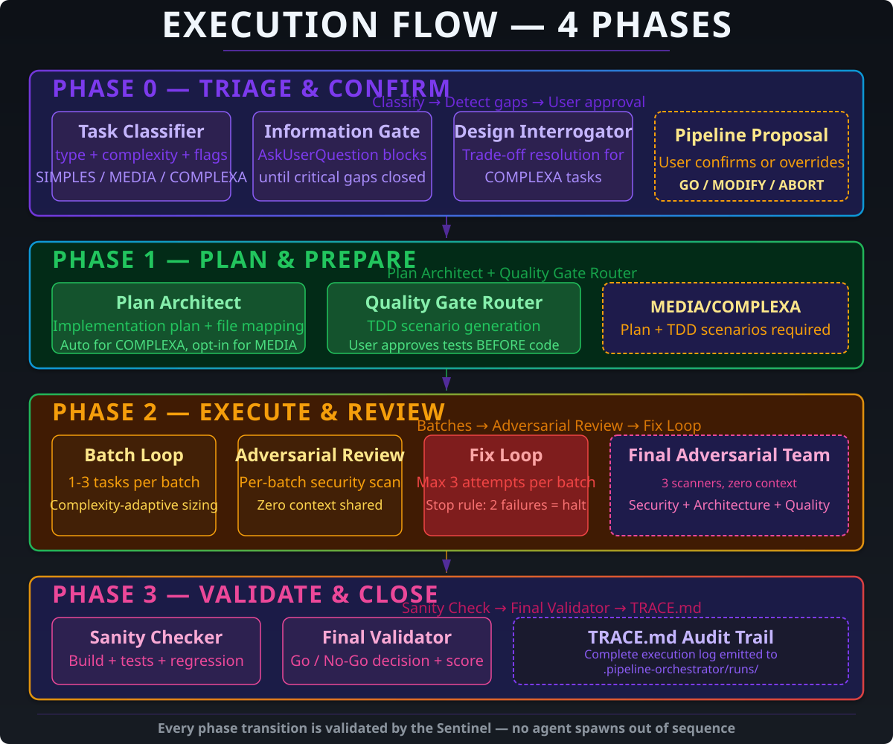

<div align="center">
  <a href="https://fxstudioai.com">
    
  </a>
</div>

<div align="center">
  
</div>

<p align="center">
  
  
  
  
  
  
  
</p>

<p align="center">
  <a href="#whats-new-in-v600">What's New</a> &bull;
  <a href="#install">Install</a> &bull;
  <a href="#how-it-works">How It Works</a> &bull;
  <a href="#pipeline-types">Pipelines</a> &bull;
  <a href="#architecture">Architecture</a> &bull;
  <a href="#gate-system">Gates</a> &bull;
  <a href="#audit-reports">Audit</a>
</p>

---

> **Note:** This repository is both the Pipeline Orchestrator plugin **and** the **FX-Studio-AI** marketplace hosting five plugins. Install the marketplace once to access them all. See <a href="#fx-studio-ai-suite">the suite section</a> at the bottom.

---

## The Problem We Solve

Today there is an abundance of tools to structure, plan, and specify software projects — Jira, Linear, Notion, Confluence, architecture decision records, and specification templates. They help teams decide *what* to build and *why*. But when it comes to the actual execution — translating those plans into production code safely — the industry relies on human discipline. And discipline degrades under pressure, time constraints, and long-running sessions.

Pipeline Orchestrator is an **end-to-end execution governance layer** that sits between your plan and your production code. It does not replace your planning tools. It closes the gap between "we have a spec" and "we shipped it safely."

### Why Execution Breaks Down

Long-running coding sessions suffer from a predictable degradation pattern:

- **Context accumulation** — the implementer holds too much state, misses contradictions
- **Confirmation bias** — the same mind that wrote the code reviews it, approving its own blind spots
- **Drifting requirements** — after hour three, the code no longer matches the original intent
- **Missing edge cases** — race conditions, auth bypasses, and SSOT conflicts slip through because no one attacked the code

Traditional CI/CD catches syntax errors and regressions. It does not catch architectural drift, security holes introduced in batch 7, or the fact that your implementation no longer matches the acceptance criteria you wrote in batch 1.

### How Pipeline Orchestrator Fixes It

**Periodic Workflow Reviews (Gates)** — The pipeline inserts mandatory checkpoints at every phase transition. Not ceremonial checkboxes: MANDATORY gates that cannot be skipped even with `--hotfix`, HARD gates that block until resolved, CIRCUIT BREAKER gates that halt the pipeline after 2 consecutive failures, and SOFT gates that log every skip and penalize your confidence score. The workflow is reviewed *while it runs*, not after it finishes.

**Adversarial Independence** — Every batch of code is reviewed by agents that receive **zero implementation context**. They do not know what you intended. They see only the result. They attack from security, architecture, and quality angles — simultaneously, in parallel — the way a real attacker or a hostile senior engineer would. This eliminates confirmation bias because the reviewer never shared the author's assumptions.

**Context Isolation** — The implementer's reasoning is never shared with reviewers. The final adversarial team is spawned in a single message with three parallel Agent calls, ensuring no sequential contamination. Each reviewer loads only relevant security checklists from `references/checklists/` and evaluates the code blind.

**Confidence Scoring** — The pipeline accumulates an objective quality signal across all phases: classification clarity, information completeness, design alignment, plan coverage, TDD coverage, and implementation quality. Skipped SOFT gates apply a penalty. The final score drives a Go/No-Go decision:

```
GO:          >= 0.80
CONDITIONAL: >= 0.60
NO-GO:       <  0.60
```

No gut feelings. No "it looks fine to me." A number.

**TRACE.md — Glass Box Audit Trail** — Every pipeline run emits a complete audit trail to `.pipeline-orchestrator/runs/<id>/TRACE.md`. Classification, pipeline definition, execution log, final verdict with confidence score and gate penalties. Attach it to your PR. Validate it with a standalone script. Auditable, reproducible, accountable.

**TDD by Default** — Tests are written BEFORE implementation (RED phase), approved by you, and validated after every batch. Not optional. Not an afterthought. If the pipeline touches code, it must prove the code works before claiming it works.

**Proportional Rigor** — A one-line typo fix does not get the same ceremony as a payment system rewrite. The pipeline automatically scales its depth by complexity: SIMPLES (light), MEDIA (moderate), or COMPLEXA (full adversarial team, 5 sentinel checkpoints, deep review). Zero configuration needed.

---

## What's New in v6.0.0

Version 6.0.0 is a **MAJOR** release following a comprehensive external audit of v5.2.0 over the IFRS 16 reference project. Four hardening waves (Fase B / Fase D / Fase H / Fase I) resolved **all 12 CRITICAL findings**, exercised **22 of 22 registry gates in runtime**, and shipped three new security mitigation libraries.

| Metric | v5.2.0 | v6.0.0 |
|--------|--------|--------|
| Subagents with explicit Achado #7 protocol | 2 of 19 | **16 of 19** |
| Gates exercised in runtime | 5 of 22 | **22 of 22** |
| Hook test suites green | 6 of 7 | **7 of 7** |
| Regression tests | 13 | **39** |
| Audit coverage | 30% | **95%** |
| CRITICAL findings open | 4 acknowledged | **0** |

### New security libraries (`lib/`)

- **`sentinel-state-signer.cjs`** — HMAC-SHA256 signature for `sentinel-state.json` (mitigates fail-open admitted by previous sentinel-hook docstring)
- **`jsonl-sanitizer.cjs`** — Safe append API for `gate-decisions.jsonl` and `protocol-events.jsonl` (mitigates JSONL injection demonstrated breaking parse)
- **`pipeline-local-parser.cjs`** — Strict parser for `.claude/pipeline.local.md` (mitigates RCE via shell metacharacters in `build_command` — POC adversarial file tested)

### Subagent protocol hardening

16 subagents now declare the **ACHADO #7 RUNTIME PROTOCOL** section explicitly in their `.md` spec. When the Claude Code harness strips `AskUserQuestion` / `Agent` / `EnterPlanMode` from a subagent's runtime, the agent emits a structured YAML block instead. The parent parses and dispatches the tool in its own context.

Fixed: `information-gate`, `plan-architect`, `design-interrogator`, `pre-tester`, `executor-fix`, `executor-implementer-task`, `spec-closer`, `feature-implementer`, `bugfix-diagnostic-agent`, `bugfix-root-cause-analyzer`, `bugfix-regression-tester`, `ux-simulator`, `ux-accessibility-auditor`, `ux-qa-validator`, `architecture-reviewer`, `sanity-checker`, `checkpoint-validator`.

### Breaking changes

1. **Subagent output format** — Subagents that previously emitted prose questions now emit structured YAML blocks (`GATE_REQUEST v1` / `DISPATCH_REQUEST v1` / `PLAN_MODE_REQUEST v1`). Consumers parsing tool results must look for these blocks.
2. **Constant rename** — `STALE_THRESHOLD_MS` → `STALE_SPAWN_THRESHOLD_MS` (sentinel-hook), `STALE_HEARTBEAT_MS` → `STALE_HEARTBEAT_THRESHOLD_MS` (edit-guard-hook). Old names preserved as deprecated aliases through v6.0.x; removal scheduled for v6.1.0.
3. **Worked-example schema** in 16 subagents now uses `multi_select` (snake_case) and `recommended: true` field instead of `multiSelect` and `(Recomendado)` suffix.

**No behavioral change** for users invoking `/pipeline-orchestrator:pipeline` or `/pipeline-orchestrator:brainstorm` — v6.0.0 hardens the runtime contract.

[Full CHANGELOG →](CHANGELOG.md)

---

## Install

### Option 1 — Claude Code marketplace (recommended)

```bash
# In Claude Code
/plugin marketplace add fernandoxavier02/Pipeline-Orchestrator
/plugin install pipeline-orchestrator
# Or, if upgrading from v5.x:
/plugin update pipeline-orchestrator
```

This is the **primary distribution channel**. You get all 22 skills, 45 agents, 8 hooks, 3 security libraries, audit reports, and visual docs — installed under `~/.claude/plugins/cache/.../v6.0.0/` and ready to use.

### Option 2 — npm registry (published as `@fx-studio-ai/pipeline-orchestrator`)

The plugin is **also** published to the public npm registry. Use this when you want to:

- Reuse the 3 security libraries (`jsonl-sanitizer`, `sentinel-state-signer`, `pipeline-local-parser`) in your own Node tooling
- Run `validate-trace` in CI without cloning the whole plugin
- Embed the audit reports / visual docs in another distribution

```bash
# Global install — exposes pipeline-orchestrator-validate-trace CLI
npm install -g @fx-studio-ai/pipeline-orchestrator

# Or as a dev dependency in your project
npm install --save-dev @fx-studio-ai/pipeline-orchestrator
```

**Programmatic use:**

```js
// Whole API surface
const po = require('@fx-studio-ai/pipeline-orchestrator');
po.safeAppendJsonl('./gate-decisions.jsonl', { gate: 'SSOT_CONFLICT', ... });

// Or import specific libraries via subpath exports
const { signState, verifyState } = require('@fx-studio-ai/pipeline-orchestrator/sentinel-state-signer');
const { parsePipelineLocalFile } = require('@fx-studio-ai/pipeline-orchestrator/pipeline-local-parser');
```

**CLI binary** (after global install):

```bash
pipeline-orchestrator-validate-trace ./.pipeline-orchestrator/runs/123/TRACE.md
# Exit 0 if valid, exit 1 with stderr diff if invalid
```

**Alternative — install from GitHub Release tarball** (no registry needed):

```bash
npm install -g https://github.com/fernandoxavier02/Pipeline-Orchestrator/releases/download/v6.0.0/fx-studio-ai-pipeline-orchestrator-6.0.0.tgz
```

> npm package and Claude Code marketplace ship the **same artifact** (git ref `v6.0.0`). Use whichever fits your workflow — they don't conflict.

---

## Entry Points — pick the right command for the task

The plugin ships **15 top-level commands**. Use the general-purpose `/pipeline` when you want auto-classification, or pick a **type-specific entry-point** when you already know the work type — they pre-classify and skip a round of triage.

### General-purpose

| Command | When to use |
|---------|---------------|
| `/pipeline-orchestrator:pipeline [task]` | Default. Auto-classifies type + complexity, runs the right variant. |
| `/pipeline-orchestrator:pipeline diagnostic [task]` | Just classify the task. No code touched. Estimate cost & scope. |
| `/pipeline-orchestrator:pipeline continue` | Resume a paused pipeline. Triggers STALE_CONTEXT gate if >24h. |
| `/pipeline-orchestrator:pipeline review-only` | Run the final adversarial team on the current dirty tree. Report only. |
| `/pipeline-orchestrator:pipeline --hotfix [task]` | Emergency bypass. Reduced scope, NOT reduced safety. |
| `/pipeline-orchestrator:brainstorm [task]` | Pre-execution spec lifecycle (9 steps: intake → explore → spec-init → requirements → design → tasks → validate-gap → validate-design → handoff). |

### 🔍 Audit — investigate existing code

| Command | When to use | Steps |
|---------|---------------|-------|
| `/pipeline-orchestrator:audit [task]` | Auto-classify audit complexity, then dispatch the right variant | classifier-dispatched |
| `/pipeline-orchestrator:audit-light [task]` | 1 area · 1 depth level · single auditor | **9-step prescriptive** |
| `/pipeline-orchestrator:audit-heavy [task]` | Full system · multi-axis · regulator-grade audit | **9-step prescriptive** |

**Example:**

```
/pipeline-orchestrator:audit-heavy Audit the payment service for OWASP Top 10
                                    vulnerabilities, focusing on auth, injection,
                                    and PCI-DSS compliance gaps. Produce a risk
                                    matrix with priority backlog.
```

Outputs: `AuditIntake → DOMAIN_ANALYSIS → COMPLIANCE_REPORT → RISK_MATRIX → audit-report.md` with VERIFIED/HYPOTHESIS/DESIGN tags per finding and file:line evidence.

### 🐛 Bug Fix — investigate, root-cause, regress-test

| Command | When to use | Steps |
|---------|---------------|-------|
| `/pipeline-orchestrator:bugfix [task]` | Auto-classify bug complexity | classifier-dispatched |
| `/pipeline-orchestrator:bugfix-light [task]` | Max 2 files · ~50 lines diff | **8-step prescriptive** |
| `/pipeline-orchestrator:bugfix-heavy [task]` | Cross-cutting · production incidents · race conditions | **11-step prescriptive** |

**Example:**

```
/pipeline-orchestrator:bugfix-heavy POST /api/checkout returns 500 sporadically
                                     in production. Logs show TypeError. Suspect
                                     race condition in cart service.
```

Pipeline: `bugfix-diagnostic-agent` (terrain map + ranked hypotheses) → `bugfix-root-cause-analyzer` (confirms cause + evidence chain) → executor implements fix → `bugfix-regression-tester` (test fails on revert, passes on fix) → final-validator.

### ✨ Feature — implement new functionality with vertical slices

| Command | When to use | Variant |
|---------|---------------|---------|
| `/pipeline-orchestrator:feature [task]` | Auto-classify feature complexity | classifier-dispatched |
| `/pipeline-orchestrator:feature-light [task]` | Single slice · small surface | feature-light |
| `/pipeline-orchestrator:feature-heavy [task]` | Multi-slice · cross-layer (UI + service + data) | feature-heavy |

**Example:**

```
/pipeline-orchestrator:feature-heavy Add a "lease summary by counterparty" endpoint
                                      GET /api/contracts/lease-summary that
                                      aggregates contracts with date filters.
                                      Requires auth. Paginated.
```

Pipeline: `feature-vertical-slice-planner` (slices ranked by value + risk, with [ASSUMPTION] tags) → `feature-implementer` (per-slice TDD) → `feature-integration-validator` (cross-slice cohesion) → adversarial review → Pa de Cal.

### 🎨 UX Simulation — predict user friction before shipping

The `/pipeline` classifier dispatches the UX team when type is `UX Simulation`:

```
/pipeline-orchestrator:pipeline Simulate the UX of a first-time user creating
                                 their first lease contract. Identify friction
                                 points, accessibility violations, and edge cases.
```

Pipeline: `ux-simulator` (persona matrix + journey maps + friction catalog) ‖ `ux-accessibility-auditor` (WCAG 2.1 AA + keyboard nav + contrast) → `ux-qa-validator` (priority matrix + action items).

### 📋 Spec — full specification lifecycle (Kiro-style)

| Command | When to use | Variant |
|---------|---------------|---------|
| `/pipeline-orchestrator:spec [task]` | Auto-classify spec complexity | classifier-dispatched |
| `/pipeline-orchestrator:spec-light [task]` | Lightweight spec · 6 steps | mode_used=slim |
| `/pipeline-orchestrator:spec-heavy [task]` | Full spec with 9-step lifecycle | mode_used=full |
| `/pipeline-orchestrator:spec-audit-only [task]` | Audit existing spec — no impl | mode_used=audit |

**Example:**

```
/pipeline-orchestrator:spec-heavy Specify a multi-tenant audit log system: append-only
                                   events, retention policy, per-tenant isolation,
                                   query API. Output requirements.md + design.md +
                                   tasks.md + spec.json.
```

Pipeline: `spec-init → spec-requirements (EARS format) → validate-gap → spec-design → validate-design → spec-tasks → spec-format-gate → spec-content-reviewer → spec-post-impl-validator → spec-closer`.

### Auxiliary skills (dispatched by the pipeline, also callable directly)

| Command | Function |
|---------|-----------|
| `/pipeline-orchestrator:spec-init [task]` | Initialize a new spec with project description |
| `/pipeline-orchestrator:spec-requirements [task]` | Generate EARS-format requirements |
| `/pipeline-orchestrator:spec-design [task]` | Architecture from requirements |
| `/pipeline-orchestrator:spec-tasks [task]` | Implementation tasks from design |
| `/pipeline-orchestrator:validate-design [task]` | Quality review of design.md |
| `/pipeline-orchestrator:validate-gap [task]` | Implementation gap analysis |
| `/pipeline-orchestrator:review [task]` | Review task implementation against spec |
| `/pipeline-orchestrator:verify-completion [task]` | Verify completion claims with fresh evidence |

### Flags for fine control

| Flag | Effect |
|------|--------|
| `--grill` | Force `design-interrogator` to walk the decision tree, even on SIMPLES |
| `--plan` | Force `plan-architect` (Phase 1.5) on any complexity |
| `--no-plan` | Skip Phase 1.5 on MEDIA (ignored on COMPLEXA — logged in TRACE) |
| `--force-level=SIMPLES\|MEDIA\|COMPLEXA` | Override classifier verdict |
| `--light` / `--heavy` | Force variant on Bug Fix |
| `--strict` | Disable fast-path for trivial cases |

---

## How It Works

<div align="center">
  
</div>

The pipeline runs in four phases. Each one has a single output that becomes the input of the next. The pipeline never moves forward without a structured handoff — every transition crosses at least one gate.

### Phase 0 — Automatic Triage

The `task-orchestrator` classifies the request: type (Bug Fix / Feature / User Story / Audit / UX Simulation / Spec), complexity (SIMPLES / MEDIA / COMPLEXA), pipeline variant, and probable affected files. The `information-gate` detects missing facts and may block. For COMPLEXA or `--grill`, the `design-interrogator` walks the design decision tree before any code is touched.

**Gates:** SSOT_CONFLICT (MANDATORY), INFO_GATE_BLOCKED (HARD).

### Phase 1 — Proposal &amp; Confirmation

The pipeline presents you the classification — type, complexity, the agent team it will spawn, the gates it will enforce. You confirm, adjust, or reject via `AskUserQuestion`. No code is touched until this gate passes.

**Gates:** COMPLEXITY_GATE (SOFT), phase-1-pipeline-proposal.

### Phase 1.5 — Planning (Conditional)

For MEDIA / COMPLEXA / Spec tasks, the `plan-architect` enters Plan Mode (read-only), researches the codebase, and produces a structured implementation plan with task order, file paths, pattern references, and risk assessment. You approve, adjust, or reject the plan.

**Gates:** PLAN_REJECTED (HARD).

### Phase 2 — Batched Execution + Adversarial Loop

Tasks are split into batches (1 task per batch for COMPLEXA, 2-3 for MEDIA, all-at-once for SIMPLES). Each task goes through:

```
micro-gate → implementer → spec-reviewer → quality-reviewer → checkpoint-validator
```

After each batch, the `ADVERSARIAL_GATE` triggers three independent reviewers in parallel (security, architecture, quality). Findings trigger a fix loop bounded to 3 attempts; if findings persist, `FIX_LOOP_EXHAUSTED` halts the pipeline.

**Gates:** TDD_APPROVAL (HARD), MICRO_GATE_GAP (HARD), CHECKPOINT_FAIL (HARD), ADVERSARIAL_BLOCK (HARD), FIX_LOOP_EXHAUSTED (CIRCUIT_BREAKER), STOP_RULE (CIRCUIT_BREAKER), ADVERSARIAL_LOOP_CHECKPOINT (SOFT).

### Phase 3 — Closure (Pa de Cal)

The `sanity-checker` runs the full build + test + regression. The `final-adversarial-orchestrator` dispatches three parallel reviewers with zero shared context for one last attack. The `final-validator` emits Go / Conditional Go / No-Go with the confidence score. `finishing-branch` offers four closeout options: commit, push+PR, keep uncommitted, discard.

**Gates:** FINAL_ADVERSARIAL_GATE (SOFT), FINAL_ADVERSARIAL_REWORK (HARD), CLOSEOUT_CONFIRM (SOFT).

---

## Agent Architecture

<div align="center">
  
</div>

The plugin contains **26 specialized agents** organized by phase responsibility. Phase 1.5 conditional planning, the per-task quality chain in Phase 2 (implementer → spec-reviewer → quality-reviewer → checkpoint-validator), and the three parallel adversarial reviewers in Phase 3 are the key load-bearing patterns.

| Layer | Agents |
|-------|--------|
| **Core** | `task-orchestrator`, `information-gate`, `sentinel`, `final-validator`, `finishing-branch`, `sanity-checker`, `checkpoint-validator`, `adversarial-batch`, `pipeline-controller`, `brainstorm-controller` |
| **Quality** | `plan-architect`, `design-interrogator`, `pre-tester`, `quality-gate-router`, `review-orchestrator`, `architecture-reviewer`, `final-adversarial-orchestrator` |
| **Executor (type-specific)** | `feature-implementer`, `feature-vertical-slice-planner`, `feature-integration-validator`, `bugfix-diagnostic-agent`, `bugfix-root-cause-analyzer`, `bugfix-regression-tester`, `audit-intake`, `audit-domain-analyzer`, `audit-compliance-checker`, `audit-risk-matrix-generator`, `ux-simulator`, `ux-accessibility-auditor`, `ux-qa-validator`, `spec-format-gate`, `spec-content-reviewer`, `spec-post-impl-validator`, `adversarial-security-scanner`, `adversarial-architecture-critic`, `adversarial-quality-reviewer`, `adversarial-review-coordinator` |
| **Executor (top-level)** | `executor-controller`, `executor-implementer-task`, `executor-fix`, `executor-spec-reviewer`, `executor-quality-reviewer`, `spec-closer` |
| **Brainstorm step agents** | `step-00-intake`, `step-01-explore` |

---

## Gate System

<div align="center">
  
</div>

Every phase transition crosses at least one gate. Gates are not ceremonial checkboxes — each has a defined hardness that determines whether it blocks, asks, or merely advises.

| Hardness | Count | Behavior |
|----------|-------|----------|
| **MANDATORY** | 3 | Never bypass. Cannot be skipped even with `--hotfix`. Failure halts the pipeline and reports to the user. |
| **HARD** | 11 | Blocks until resolved. Pipeline stops at the gate. User must answer or the issue must be fixed before continuing. No silent skips. |
| **CIRCUIT_BREAKER** | 3 | After N consecutive failures or attempts (typically 2-3), pipeline halts and requires manual intervention. Prevents infinite loops. |
| **SOFT** | 5 | Recommended but skippable. Every skip is logged with a confidence penalty. Operators can override; the audit trail records each decision. |

Full registry in [`references/gates.md`](references/gates.md). Audit-trail invariants in [`references/audit-trail.md`](references/audit-trail.md).

---

## Pipeline Types

The plugin scales depth automatically by complexity. A typo fix does not get the same ceremony as a payment system rewrite.

| Complexity | Threshold | Batch size | Plan mode | Adversarial | Sentinel checks | Typical wall-clock |
|------------|-----------|------------|-----------|--------------|-------------------|---------------------|
| **SIMPLES** | 1-2 files · &lt;30 lines · 1 domain | all-at-once | skipped | 2 checklists | 2 of 5 | ~5-15 min |
| **MEDIA** | 3-5 files · 30-100 lines · 2 domains | 2-3 tasks | automatic | 5 checklists | 3-5 of 5 | ~30-60 min |
| **COMPLEXA** | 6+ files · &gt;100 lines · 3+ domains | 1 task | mandatory | 7 checklists | all 5 | ~90-180 min |

---

## Architecture

| Layer | Component |
|-------|-----------|
| **Commands** | `/pipeline`, `/brainstorm` — entry points (`commands/`) |
| **Controllers (N1)** | `pipeline-controller`, `brainstorm-controller`, `executor-controller` (`agents/core/`) |
| **Subagents** | 26 specialized agents in `agents/core/`, `agents/quality/`, `agents/executor/` |
| **Skills** | Variant entry-points: `bugfix-light`, `feature-heavy`, `spec-light`, etc. (`skills/`) |
| **Hooks** | `sentinel-hook`, `dispatch-guard`, `edit-guard-hook`, `force-pipeline-agents`, `session-lock-hook`, `session-cleanup-hook`, `completion-checklist`, `skill-frontmatter-parser` (`.claude/hooks/`) |
| **Security libs** (v6.0.0+) | `sentinel-state-signer`, `jsonl-sanitizer`, `pipeline-local-parser` (`lib/`) |
| **References (SSOT)** | `gates.md`, `gate-request-protocol.md`, `audit-trail.md`, `confidence.md`, `complexity-matrix.md`, `stale-thresholds.md`, `glossary.md` (`references/`) |
| **Tests** | 39 regression tests in `tests/regression/v6.0.0/`, 7 hook test suites in `.claude/hooks/__tests__/` |
| **Audit Reports** | `docs/audits/2026-05-15-ifrs16-deep-audit/` (9 files) |

### Bonus: standalone HTML diagrams

For interactive deep-dives (custom design system, cross-navigation, no GitHub markdown limitations), open these directly in any browser by cloning the repo:

- [`docs/diagrams/index.html`](docs/diagrams/index.html) — catalog
- [`docs/diagrams/pipeline-overview.html`](docs/diagrams/pipeline-overview.html) — 4 phases + execution modes
- [`docs/diagrams/achado-7-protocol.html`](docs/diagrams/achado-7-protocol.html) — emit-and-hoist subagent protocol
- [`docs/diagrams/gate-hierarchy.html`](docs/diagrams/gate-hierarchy.html) — 22 gates by hardness
- [`docs/diagrams/audit-history.html`](docs/diagrams/audit-history.html) — v5.2→v6.0 audit timeline

---

## Audit Reports

The v6.0.0 release ships with 9 archived audit reports under [`docs/audits/2026-05-15-ifrs16-deep-audit/`](docs/audits/2026-05-15-ifrs16-deep-audit/):

| File | Purpose |
|------|---------|
| [`INDEX.md`](docs/audits/2026-05-15-ifrs16-deep-audit/INDEX.md) | Reading order + executive summary |
| [`_canonical_contract.md`](docs/audits/2026-05-15-ifrs16-deep-audit/_canonical_contract.md) | Audit ground truth (22 gates, 45 agents) |
| [`_decision_table.md`](docs/audits/2026-05-15-ifrs16-deep-audit/_decision_table.md) | Unified gate response policy |
| [`FINAL_CONSOLIDATED_REPORT.md`](docs/audits/2026-05-15-ifrs16-deep-audit/FINAL_CONSOLIDATED_REPORT.md) | Phase B+D matrix (7×N gates, 7×45 dispatch) |
| [`PANEL_FINAL.md`](docs/audits/2026-05-15-ifrs16-deep-audit/PANEL_FINAL.md) | 3-persona panel consolidation |
| [`FASE_H_FINDINGS.md`](docs/audits/2026-05-15-ifrs16-deep-audit/FASE_H_FINDINGS.md) | Second-pass deep audit (hooks + anti-injection POCs) |
| [`FASE_H_ADDENDUM.md`](docs/audits/2026-05-15-ifrs16-deep-audit/FASE_H_ADDENDUM.md) | Runtime dispatches Phase 3 + fix loop + skills |
| [`FASE_H_FINAL.md`](docs/audits/2026-05-15-ifrs16-deep-audit/FASE_H_FINAL.md) | Coverage consolidation + false-positive retraction |
| [`FASE_I_FINAL.md`](docs/audits/2026-05-15-ifrs16-deep-audit/FASE_I_FINAL.md) | Residual coverage + 3 security libraries |
| [`COMPARISON_v5.2_vs_v5.3.md`](docs/audits/2026-05-15-ifrs16-deep-audit/COMPARISON_v5.2_vs_v5.3.md) | Pre/post comparison with runtime evidence |

The audit was performed against the **IFRS 16 lease accounting** reference project (Python/FastAPI + TypeScript/React) using seven git worktrees and a 3-persona adversarial panel.

---

## Tests

Regression suite under `tests/regression/v6.0.0/`:

```
D2_test_subagent_protocol.cjs           16 tests · Achado #7 protocol in 16 subagents
D2_subagent_protocol_compliance.feature        BDD Gherkin
D9_test_orphan_cleanup_spec.cjs          1 test · ORPHAN_CLEANUP mode in sentinel.md
I4_I5_I6_lib_test.cjs                   14 tests · HMAC signer + JSONL sanitizer + parser
I7_stale_thresholds_consistency.cjs      8 tests · SSOT + canonical names + cross-refs
eval_C4_diagnostic.feature                       BDD Gherkin for DIAGNOSTIC mode
```

Run the full suite:

```bash
node tests/regression/v6.0.0/D2_test_subagent_protocol.cjs
node tests/regression/v6.0.0/D9_test_orphan_cleanup_spec.cjs
node tests/regression/v6.0.0/I4_I5_I6_lib_test.cjs
node tests/regression/v6.0.0/I7_stale_thresholds_consistency.cjs
for t in .claude/hooks/__tests__/*.test.cjs; do node "$t"; done
```

Total: **39 regression tests** + **7 hook test suites** all PASS.

---

## FX Studio AI Suite

This repository is both the Pipeline Orchestrator plugin **and** the FX-Studio-AI marketplace hosting five plugins. Install the marketplace once to access them all:

- **pipeline-orchestrator** (this plugin) — execution governance
- **skill-advisor** — intelligent toolchain orchestrator
- *more in the marketplace*

```bash
/plugin marketplace add fernandoxavier02/Pipeline-Orchestrator
/plugin list
```

---

## Contributing

Contributions welcome. This is an active project with a strong audit culture.

1. Read the [audit reports](docs/audits/2026-05-15-ifrs16-deep-audit/INDEX.md) to understand the architectural decisions
2. Pick an issue from the [backlog](notes/v5.3.0-audit-backlog.md) or open a new one
3. Every code change must pass the regression suite
4. New subagents must declare the **ACHADO #7 RUNTIME PROTOCOL** section
5. New gates must be added to `references/gates.md` registry AND `commands/pipeline.md` Inline Invariants AND covered by a runtime test

---

## License

MIT © FX Studio AI

---

<div align="center">
  <p><strong>Pipeline Orchestrator v6.0.0</strong> · 2026-05-15</p>
  <p>Built by <a href="https://github.com/fernandoxavier02">FX Studio AI</a> · <a href="https://github.com/fernandoxavier02/Pipeline-Orchestrator">Source on GitHub</a></p>
</div>
