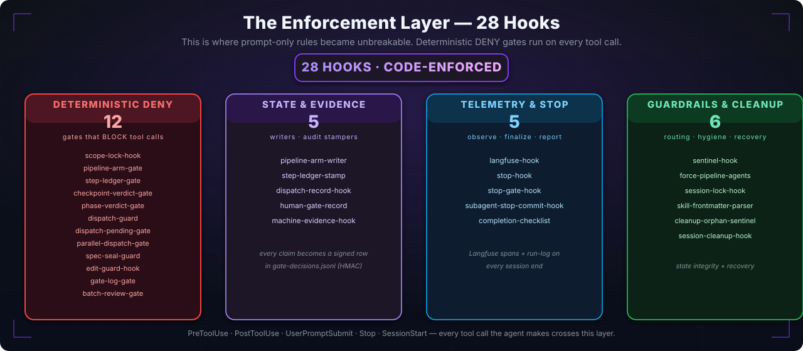

# The Enforcement Layer & The Gate System

> What separates Pipeline Orchestrator from prompt-only governance. Moved from the README front page — the [README](../README.md) keeps the summary; this document keeps the detail.

## The Enforcement Layer

The rules are not advice the agent *may* follow — they are hooks that run on every tool call and **deny** the action if it breaks contract. **38 `.cjs` hooks** in `.claude/hooks/`, several of them deterministic `DENY` gates.

  

**SCOPE LOCK CHECK (`scope-lock-hook.cjs`)** runs before every `Write`/`Edit`/`Bash` write. It compares the target against the active `CHANGE_CONTRACT`:

- target file not in `allowed_files` → **DENY**
- change type in `forbidden_change_types` (`new_dependency_without_approval`, `public_api_change`, `schema_migration`, `test_weakening`) → **DENY**
- cumulative `diff_budget` exceeded → **DENY**

**The arming chain (v8.7–v8.8)** means the agent cannot do real work until a pipeline run is *armed* and *runs in order*: `pipeline-arm-gate` blocks until `pipeline-arm-writer` stamps the arm-pending marker (HMAC-signed via the sentinel-state signer — a tampered marker reads as *not armed*); `step-ledger-gate` then enforces that steps run in ledger order; `dispatch-pending-gate` blocks any parent work while a subagent handshake is pending; `gate-log-gate` rejects events that don't flow through the SSOT writer. Refactor pipelines add `REFACTOR_SCOPE_LOCK` — the first production write is denied until that marker lands.

**Reachable next actions (v8.24).** A governed deny is never a dead end: the highest-value enforcement hooks always name one executable next action a subagent can actually take, and the `/pipeline-orchestrator:unblock` skill diagnoses a stuck session deterministically.

**Anti-fabrication guard (v8.23).** A dedicated PreToolUse gate blocks forged writes to the audit trail at the moment they happen — retro-dated entries without a backfill marker, `GO`/`completed` verdicts without their closing chain, and user-attributed decisions without a matching user protocol event.

**Glass-box audit trail.** Every gate decision is written through `lib/gate-decision-writer.cjs::appendGateDecision` (direct `fs.appendFile` is flagged `REJECTED` by the diff-discipline reviewer) into `gate-decisions.jsonl` with HMAC integrity. `scripts/validate-trace.cjs` is a standalone Node script that re-verifies a run end-to-end — you can attach its output to a PR for compliance. The `sentinel-state` signature is verified two-tier: unsigned is tolerated (warn), a bad signature fails closed under `PIPELINE_HMAC_STRICT`. Since v8.27, user-gate events are HMAC-signed too, and an invalid signature is rejected unconditionally.

**Achado #7 protocol.** Every subagent declares its runtime protocol (`GATE_REQUEST` / `DISPATCH_REQUEST`) because the Claude Code harness strips interactive tools (`AskUserQuestion`, `EnterPlanMode`, `Agent`) from subagent contexts. The protocol makes parent↔child handshakes explicit instead of relying on tools that silently disappear. New subagents must declare this section — it is a contribution requirement.

## The Gate System

  

Every phase transition crosses at least one gate. Each gate has a defined **hardness** that determines whether it blocks, asks, or merely records.

| Hardness | Behavior |
|---|---|
| **MANDATORY** | Never bypassed — not even by `--hotfix`. Structural integrity (SSOT) and domain-mandated security reviews. |
| **HARD** | Blocks until resolved; clear resolution path (answer, approve, fix). |
| **CIRCUIT_BREAKER** | Halts after N consecutive failures; requires explicit reset. Prevents infinite loops. |
| **SOFT** | Recommended; skippable with explicit acknowledgment (logged, confidence penalty). |
| **AUDIT** | Informational telemetry; never blocks. First-class audit-trail row. |

Mandatory-gate counts scale with complexity: **SIMPLES 11 · MEDIA 13 · COMPLEXA 18** (SIMPLES was raised from 6 in v8.6, when plan mode + adversarial review became universal). Full registry in [`references/gates.md`](../references/gates.md). The mandatory-gates table is pinned by a regression test that parses the doc and the matching constant in `lib/fidelity-reporter.cjs` and fails the build if they ever disagree — so the docs cannot silently drift from the code.
